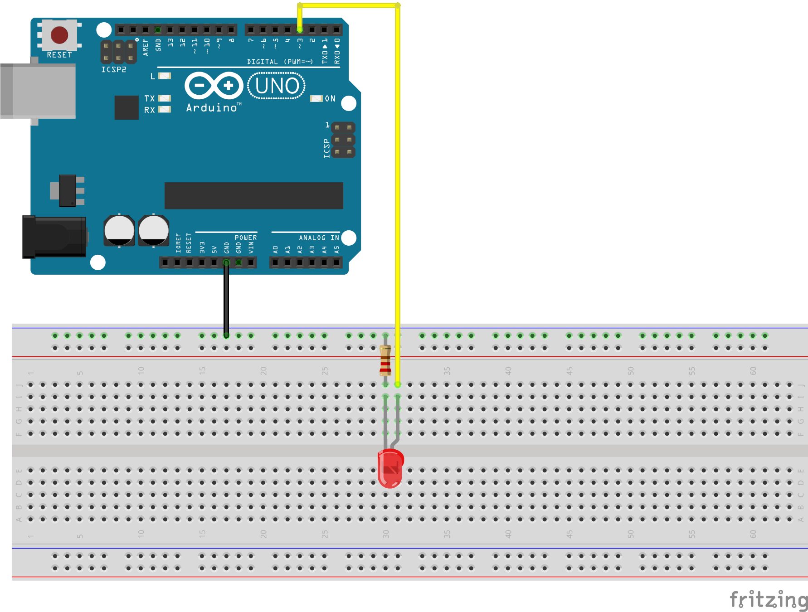

# Introduction Arduino

Code for a creative coding class with arduino for designers.

[Arduino](https://www.arduino.cc/) is a brand of open hardware electronic cards: ie cards whose diagrams are freely available and free of charge.

Arduino is a project that began in 2003 at the Ivrea Interaction Design Institute (now integrated with the Domus Academy - a private design school based in Milan, Italy) as a pedagogical project for students, seeking to enable them at reduced cost and as simply as possible to create objects interacting with their environment through sensors and actuators.

An arduino card consists of a platform of inputs / outputs directed by a microcontroller that can be programmed via the eponymous software. The arduino project has been used extensively in the areas of rapid prototyping, related to interactive multimedia programming related to the creation of shows or digital art installations.

Projects made with this type of card can then be autonomous, connected to the Internet (IOT), or can communicate directly with one or more computers.

These cards have a multitude of input and output components, expansion cards and a very active community. Arduino is a brand that means there are arduino card clones that have very similar characteristics. We will use by abuse the term arduino to define all the activity of creating circuits and programming cards.

There are different models of cards with more or fewer inputs / outputs, which require more or less energy to operate and whose processors (or micro-controllers) are more or less fast and or efficient. (Mega, Leonardo, Uno etc.)

Here we will focus on how to recover values ​​from different sensors, how to activate actuators and how to make  an arduino card and a  [processing](https://processing.org/) program to communicate with each other.

Each example will include a circuit diagram to make and code to write and upload to a board. The first part consists of a small inventory of sensors, the second will present some actuators (motors, leds and digits display), the third part will recover information from a sensor to transmit it to an actuator, and finally the fourth part will bring us to bridge the gap between a computer and our arduino board.

You can also find all the code and explanation on this [github repo](https://github.com/b2renger/Introduction_Arduino/tree/english)

## Contents
* [Introduction](#Introduction) <br>

* [Connect sensors and retrieve values](#Connect-sensors-and-retrieve-values) <br>

  * [Digital inputs and logic sensors](#Digital-inputs-and-logic-sensors) <br>
    * [Tilt](#Tilt) <br>
    * [PIR](#PIR) <br>
    * [Microswitch](#Microswitch) <br>
    * [Button](#Button) <br>
  
  * [Analog inputs](#Analog-inputs) <br>
    * [Potentiometer](#Potentiometer) <br>
    * [Mic](#Mic) <br>
    * [Photoresistor](#Photoresistor) <br>
    * [Piezo Sensor](#Piezo-sensor) <br>
    * [Flex](#Flex) <br>
    * [FSR](#FSR) <br>

  * [Distance Sensors](#Distance-sensors) <br>
    * [Infra-red](#Infra-red) <br>
    * [Ultra-sound](#Ultra-sound) <br>
      * [Ultra-sound grove](#Ultra-sound-grove) <br>
      * [Ultra-sound hc sr04](#Ultra-sound-hc-sr04) <br>

  * [Digital sensors SDA and SCL inputs](#Digital-sensors-SDA-and-SCL-inputs) <br>
    * [Accelerometer](#Accelerometer) <br>
    * [Gyroscope](#Gyroscope) <br>
    * [Gesture](#Gesture) <br>
    
* [Connect actuators and enable devices](#Connect-actuators-and-activate-devices) <br>

  * [Turn on leds](#Turn-on-leds) <br>
    * [Blink](#Led-blink) <br>
    * [Pulse](#Led-pulse) <br>

  * [Activate a vibrator](#Activate-a-vibrator) <br>
    * [Blink](#Vibrator-blink) <br>
    * [Pulse](#Vibrator-pulse) <br>

  * [Rotate a servomotor](#Rotate-a-servomotor) <br>
    * [Classic sevomotor](#Classic-servomotor) <br>
    * [Continuous rotation](#Continuous-rotation-servomotor) <br>
    * [Linear Servomotor](#Linear-servomotor) <br>

  * [Light up leds neopixel](#Light-up-leds-neopixel) <br>
    * [RGB](#RGB) <br>
    * [HSB](#HSB) <br>
  
  * [Use a 7 segments display](#Use-a-7-segments-display) <br>

* [Control an actuator with a sensor](#Control-an-actuator-with-a-sensor) <br>
  * [Use the map() function](#use-the-map-function) <br>
  * [Potentiometer to servo](#Potentiometer-to-servo) <br>
  * [Flex to continuous Servo](#Flex-to-continuous-servo) <br>
  * [FSR to neopixels](#FSR-to-neopixels) <br>

* [Use sensors to control processing code](#Use-sensors-to-control-processing-code) <br>
  * [Control video playback with a distance sensor](#Control-video-playback-with-a-distance-sensor) <br>
  * [Control an animation with a photoresistor](#Control-an-animation-with-a-photoresistor) <br>
  * [Control neopixels leds with the mouse](#Control-neopixels-leds-with-the-mouse) <br>
  * [Save data to a file on your computer](#Save-data-to-a-file) <br>

## Introduction

When we say that an arduino card is an input / output board it means that this board can measure electrical currents (input) or generate electrical currents (output).

Measuring currents makes it possible to connect sensors and check their status: for example, measuring the output current of a brightness sensor enables us to estimate the ambient luminosity.

Generating currents makes it possible to connect actuators and thus to run an engine more or less quickly or to light LEDs more or less. Code will drive the interaction and the link between our different elements.

An arduino card looks like this:

<br>

On the left hand side, try to find the **analog inputs** numbered from **A0** to **A5**, on the right you can find the **digital pins** numbered from 0 to 13.

Note that we are talking about *analog* inputs and digital *pins*. To sum up A0 up to A5 are inputs and only inputs; moreover they are *analog* which means that you will be able to measure values ​​between 0 and 1023.

The digital *pins* can be used either as inputs or as outputs (this is specified in the code we write) and handle only 0 and 1 (a digital or digital signal) - even if this is not quite true because some we have a small tilde **~** represented before their number, it means that these *pins* can generate a pulse width modulation (PWM) signal but that's another story and we will talk about it later.

It is important to also note the pins **5V** and **GND** these correspond to the power pins. Each component must be powered by electricity and we will use them systematically.

To simplify things avoid connecting sensors on the digital pins D0 and D1 at the beginning.

When we have been able to connect components to our board, we will use code to measure currents: **read** on a **digital** input or **analog** input, or **write** on a **digital** output.

The code is written in the Arduino Integrated Development Environment (IDE), which you can find and download at this address: https://www.arduino.cc/en/Main/Software

Take the * Desktop * version:

<br>

Once downloaded, installed and opened you should find yourself in front of a window looking like this:

<br>

So we will type text in this page to program our electronic card.

The first two buttons at the top left allow you to **check** and **upload** your code to the card, the following buttons are used to create a new program, open a program or save a program, and the button all on the right is used to open the **serial monitor** (this is where our program can write information to inform us about the smooth running of the task or to observe raw sensor values).

The black area corresponds to the **error console**: the software will indicate here (and often in red) when there are errors in the program we have written, or communication problems with the card.

Finally the white area is the code area. You can see two functions already named **setup()** and **loop()**. This is the basic structure of any arduino program. 

In the braces that enclose the **setup()** function you will write code that will only be executed once at the beginning of your program. For example open a serial communication with our computer:

```c
void setup() {
  // put your setup code here, to run once:
  Serial.begin(9600);
}
```

And between the braces that delimit the **loop()** function you will write code that will be executed in a loop once the program has started. For instance : print in the serial monitor the value read on the analog input 0:

```c
void loop() {
  // put your main code here, to run repeatedly:
  Serial.println(analogRead(0));
}
```
Remember that you must type the instructions exactly as the arduino card is waiting for them, the slightest typo (capital, semicolon or missing parenthesis) will cause your program to not work because the card will not be able to understand the instructions it must perform.

Note that it is possible to write comments in language for a human: by placing **//** in front of a line it will not be read / executed.

Once the program written it must be **uploaded** to the board. Beforehand you must specify on what **board type** you want to upload the program and say precisely the board or **port** on which to upload - because we could very well have several cards connected to one computer.

To do this you have to go to the *Tools* menu and then select *Arduino / Genuino Uno* as the **board type** and choose the right board from the **Port** menu (of course at this stage you need your card to be connected to a USB port of your computer):

<br>

Once done, you can **check** your program and **upload** it.

When we make a circuit our card must be disconnected from our computer, when we code it is better to keep it connected.

[**home**](#Contents)


## Connect sensors and retrieve values

This first part consists of a small inventory of sensors. Each time you will have an assembly schematics and code to read the value of the sensors and print it in the serial monitor.

In terms of code we will mainly use two functions: 
- [**digitalRead()**](https://www.arduino.cc/reference/en/language/functions/digital-io/digitalread/) to **read** a value from a **digital** pin.
- [**analogRead()**](https://www.arduino.cc/reference/en/language/functions/analog-io/analogread/) to **read** a value of an **analog input**.

And more controls related to the serial monitor:   
- [**Serial.begin()**](https://www.arduino.cc/en/Serial/Begin) which allows to open a serial connection via the USB cable (to recall the acronym usb means Universal Serial Bus) to retrieve values with our computer.
- [**Serial.println()**](https://www.arduino.cc/reference/en/language/functions/communication/serial/print/) which allows you to enter values ​​in the serial port.

In a general way the code will always be the same and it will consist of:

- open a serial connection to write the values ​​of the sensors on our computer.
- read the value received from a specific pin.
- write it in the serial monitor.

From an electronic point of view, sometimes we will use resistors and sometimes not. The principle of a resistance is to allow a little dissipation of the current that runs through our assembly. There are several values ​​from a few ohms to several million ohms, the higher the value, the more they will dissipate the current because at constant voltage: **U = R * I**, this is the **ohms law**; the voltage is equal to the resistance times the intensity - therefore the intensity is equal to the voltage divided by the resistance.

Depending on the current required for optimal operation of our sensors, we will have to choose a suitable resistor.

[**home**](#Contents)

### Digital Inputs and Logic Sensors

We have 14 digital inputs. Typically a digital pin will only measure two types of current: either there is current, or there is none / *HIGH* or *LOW* / 1 or 0 / *True* or *False*.

[**home**](#Contents)

#### Tilt

The * tilt * sensor can detect sudden changes in motion or orientation changes. A small metallic ball will come into contact with the wall and thus close a circuit to let the current flow.

Here is what it looks like:

<br>

One leg connected to ground the other will be connected to current, if the ball and the body of the sensor come into contact : the current passes and can therefore be measured; we thus obtain either a 1 or a 0 depending on the state of the sensor.

Example of use :

<br>


The circuit to realize:

<br>

Here we use a resistor of 10 kilo ohms, to protect our sensor and our card: this allows us to lower the current flowing before measuring it.

The code is very simple, we must:

- open a serial connection to write the sensor values.
- specify in our program that we use pin 7 as an input.
- read the value received on pin 7.
- write it in the serial monitor.

The first two steps can only be performed once when the card is turned on: they will go into the **setup()**; the next two steps must be done in a loop to always update the value read on the sensor so they will go into the **loop()**.


```c
void setup() {
  Serial.begin(9600); // open the serial connection
  pinMode(7, INPUT); // specify that pin 7 will be used as an entry
}

void loop() {
  int value = digitalRead(7); // read the value on pin 7 and store it in an integer variable
  Serial.println(value); // print the contents of the variable in the serial monitor
}
```

[**home**](#Contents)

#### PIR

The [*PIR*](https://en.wikipedia.org/wiki/Passive_infrared_sensor) sensor is a Presence sensor with Infra Red, it can detect the presence of someone in a specific field of view. These are typically sensors in all public places whose lights turn on automatically.

These sensors return a 1 for a certain time (here 3 seconds) when they detect a presence and 0 otherwise.

<br>

Here instead of opening the **serial monitor**, the result is displayed in the **serial plotter** available via the *Tools* -> *Serial Tracer* menu.

The *PIR* is often accompanied by a small printed circuit and it is therefore not necessary to add resistance because it has already been done on the board accompanying the sensor.

<br>

The code is identical to the previous code if we have also connected the * PIR * sensor to input 7:

```c
void setup() {
  Serial.begin(9600); // open the serial connection
  pinMode(7, INPUT); // specify that pin 7 will be used as an entry
}

void loop() {
  int value = digitalRead(7); // read the value on pin 7 and store it in an integer variable
  Serial.println(value); // print the contents of the variable in the serial monitor
}
```
[**home**](#Contents)

#### Microswitch

The microswitch is in the same family as the switches or buttons. When we press the circuit is closed, we can then measure a 1 - otherwise the circuit is open and there is no current that passes so we measure a 0.

<br>

<br>

Again the code is identical except that our component is connected to the digital input 2
```c
void setup() {
  Serial.begin(9600); // open the serial connection
  pinMode(2, INPUT); // specify that pin 7 will be used as an entry
}

void loop() {
  int value = digitalRead(2); // read the value on pin 7 and store it in an integer variable
  Serial.println(value); // print the contents of the variable in the serial monitor
}
```

[**home**](#Contents)

#### Button

The buttons may appear at first glance as the simplest component to use, but this is not really the case - it is advisable to first use the microswitch before switching to the button. Circuits can be complicated (especially when you want to have many) and the code is not necessarily the simplest - we are used to having different types of button interactions that sometimes require a little bit of expertise.

Buttons are of different sizes and shapes, they can have 2, 3 or 4 legs but the principle is always the same: when you press the button, the circuit closes and thus the current can pass. By measuring this current on a digital pin one obtains either a 0 (open circuit = no current) or a 1 (closed circuit = the current passes). It is possible to obtain more complex behavior than this simple reading and to "recognize" double clicks, long presses, etc. by using a library.

<br>

The arcade button has 3 pins, the small button at the bottom right has 4 and the button at the bottom left has 3 pins too (it is a capacitive button).

The electronic circuit is essentially the same for all the buttons: it is better to plug the button with 3 wires: 2 for the power supply (black and red) with a resistance of 10kohms on the ground, and a wire (yellow) for reading the value. The capacitive button grove is already mounted on a small card with a built-in resistor.


[**home**](#Contents)

#### Circuits

##### Le bouton capacitif

<br>

##### Le bouton "classique"

<br>

##### Le bouton d'arcade

<br>


[**home**](#Contents)

#### Code
Unlike the previous examples there will be two code examples for two different behaviors.
- The first will just read the data on pin 2. The value read will therefore be 0 if the button is not pressed and 1 if it is.
- The second one will manipulate a variable to make it change its state. So every time we click the button (this means press and release), a variable will change its state to be either a 0 or 1.

<br>

[**home**](#Contents)

#### Read the value of a button

```c
void setup() {
  Serial.begin(9600); // open the serial connection
  pinMode(2, INPUT); // specify that pin 2 will be used as an entry
}

void loop() {
  int value = digitalRead(2); // read the value on pin 2 and store it in an integer variable
  Serial.println(value); // print the contents of the variable in the serial monitor
}
```
[**home**](#Contents)

#### Use a click to change a state
The code here is a bit more complex: it uses a custom written function that allows you to change the state of a variable according to the click and the previous value of the variable: it is the defined function at the bottom called **button_change()**. This function expects 3 parameters:
- the pin on which the button is connected.
- a boolean variable (true or false) for storing the current state of the button.
- a boolean variable for storing the previous state of the button.


```c
bool b1pval = false; // previous value of the button
bool b1val = false; // current value of the button

void setup() {
  Serial.begin(9600); // open the serial connection
  pinMode(2, INPUT); // specify that pin 2 will be used as an entry
}

void loop() {
  // call the function on pin 2
  // with as previous value of the button the variable b1pval
  // and as the current value of the button the variable b1val
  button_change(2, &b1pval, &b1val); 
  Serial.println(b1val);
}

void button_change(int pin, bool *pval, bool *val) {
  if (digitalRead(pin) == 1) {
    if (*val == *pval) {
      *val = !*val;
    }
  }
  else {
    *pval = *val;
  }
}
```
In this code you can notice the appearance of the characters * and & that are specific to the languages ​​of the family C and which are used in the manipulation of the pointers.

This is a concept that can be complex to understand, but for simplicity it means that we can directly manipulate the memory space of a computer or an electronic board. Here it is useful to be able to handle dynamic variables within a function by passing as parameter the memory space to handle.

To know more :
- https://www.arduino.cc/reference/en/language/structure/pointer-access-operators/reference/

- https://www.arduino.cc/reference/en/language/structure/pointer-access-operators/dereference/

- https://en.wikipedia.org/wiki/Pointer_%28computer_programming%29

There are also libraries for using the buttons. You can access the arduino library manager by clicking on the menu: *Sketch* -> *Include Library* -> *Manage Libraries*.
You can search for two libraries:
- EasyButton
- OneButton
Once installed, examples of use will be available in the menu: *File* -> *Examples*

[**home**](#Contents)

### Analog Inputs

Analog inputs and analog sensors unlike digital inputs and logic sensors will provide us with a range of values, these values ​​will be between **0** and **1024** when using a 10 bit DAC (usually the case on most arduino boards).

[**home**](#Contents)

#### Potentiometer 

The [*potentiometer*](https://en.wikipedia.org/wiki/Potentiometer) is a classic of electronics: depending on its position, its internal resistance vary which will measure a current more or less strong and encoded between 0 and 1024.

<br>

The potentiometer has 3 legs: both ends are dedicated to its power supply (one connected to **GND** the other to **5V**, the central leg carries the signal that we want to read and will be connected to an **analog input**.

<br>

The code is very similar to the code of logic sensors except : that the analog pins are necessarily inputs and it is therefore not necessary to specify the use with **pinMode()**, and that we read on an analog input using **analogRead()** instead **digitaleRead()**:

```c
void setup() {
  Serial.begin(9600); // open the serial connection
  
}

void loop() {
  int value = analogRead(0); // read the value on the pin A0 and store it in an integer variable
  Serial.println(value); // print the contents of the variable in the serial monitor
}
```

[**home**](#Contents)

#### Mic

The mics most often used in electronics are [electret microphones](https://en.wikipedia.org/wiki/Electret_microphone) in our case the microphone is already mounted on a printed circuit, so we have not much to add and we will be able to recover a value between 0 and 1023 representing the sound level. In this case we will not be able to record a sound to replay it afterwards, the goal is only to measure the sound level.

There are a multitude of mics some have adjustment wheels to calibrate their sensitivity.

<br>

We will use only 3 of the 4 pins of the connector: two for the power supply and the third for reading the analog data. The manufacturer's wiki tells us which connections are available on the spindle: http://wiki.seeedstudio.com/Grove-Sound_Sensor/

<br>

```c
void setup() {
  Serial.begin(9600); // open the serial connection
  
}

void loop() {
  int value = analogRead(0); // read the value on the A0 pin and store it in an integer variable
  Serial.println(value); // to print the contents of the variable in the serial monitor
}
```

[**home**](#Contents)

#### Photoresistor

The [*photoresistor*](https://en.wikipedia.org/wiki/Photoresistor) varies its resistance according to the brightness it receives. There are all sizes and sensitivities.

<br>

To protect the current reading on our analog input we are going to a resistance of 10 kilo ohms. We find a circuit quite similar to that of a logical tilt sensor.

<br>

We read the signal on the analog input A0: 

```c
void setup() {
  Serial.begin(9600); // open the serial connection
  
}

void loop() {
  int value = analogRead(0); // read the value on the pin A0 and store it in an integer variable
  Serial.println(value); //  print the contents of the variable in the serial monitor
}
```


[**home**](#Contents)

#### Piezo sensor

The piezoelectric sensor uses the principle of [*piezoelectricity*](https://en.wikipedia.org/wiki/Piezoelectricity) which causes certain materials to become deformed when they are subjected to an electric current or on the contrary they can also generate electricity when they are deformed.

It can be used as a vibration sensor either as a contact mic, or as a small speaker to vibrate at given frequencies (and therefore also acts as an actuator!)

Here we will detect vibrations and measure their level.

<br>

To protect our input, but also because compared to a resistance of 10kOhms it will give better readings, we will use a resistance of 100kOhms.

<br>

The code remains the same as long as our sensor is on the same input.
```c
void setup() {
  Serial.begin(9600); //open the serial connection
  
}

void loop() {
  int value = analogRead(0); // read the value on the A0 pin and store it in an integer variable
  Serial.println(value); // to print the contents of the variable in the serial monitor
}
```

[**home**](#Contents)

#### FSR 

*FSR* sensor is a force sensor: it will convert the weight applied on its surface into a measurable electric current.

<br>

We find the same type of diagram as for the sensor *tilt* or that for the *piezo* or the *photoresistance*. Here it is mounted with a resistance of 47 kOhms, but you can try to adjust this value to refine the precision.

<br>

```c
void setup() {
  Serial.begin(9600); // open the serial connection
  
}

void loop() {
  int value = analogRead(0); // read the value on the A0 pin and store it in an integer variable
  Serial.println(value); // print the contents of the variable in the serial monitor
}
```

[**home**](#Contents)

#### Flex

The *flex sensor* will convert the curvature that it takes to a value between 0 and 1023. It should be noted that subjected to no constraints the value read must be around 511, it means that our sensor can detect a flexion in both ways.

<br>

Here it is mounted with a resistance of 47 kOhms, but you can try to adjust this value to refine the precision.

<br>

```c
void setup() {
  Serial.begin(9600); // open the serial connection
  
}

void loop() {
  int value = analogRead(0); // read the value on the A0 pin and store it in an integer variable
  Serial.println(value); // print the contents of the variable in the serial monitor
}
```

[**home**](#Contents)


### Distance sensors

There are several methods to calculate distances: infra-red, ultra-sound, laser. Here we will focus on the first two technologies.

[**home**](#Contents)

#### Infra-red

The infrared sensor will allow a system of lenses and trigonometric equations to estimate a distance. The [model we use](https://www.gotronic.fr/art-capteur-de-mesure-sharp-gp2y0a21yk0f-11539.htm) allows to obtain an estimation of the distance for distances between 10 and 80 cm and to read the result on an analog input.

<br>

<br>

```c
void setup() {
  Serial.begin(9600); // open the serial connection
  
}

void loop() {
  int value = analogRead(0); // read the value on the A0 pin and store it in an integer variable
  Serial.println(value); // print the contents of the variable in the serial monitor
}
```

[**home**](#Contents)


#### Ultra-sound

There are different types of ultrasonic sensors to measure distances which is a little more precise and allows to have a greater range (up to a few meters) than the infrared method
- The classic [HC-SR04](https://www.gotronic.fr/art-module-de-detection-us-hc-sr04-20912.htm) which requires a 4-wire connection.
- The [grove module](https://www.gotronic.fr/art-telemetre-a-ultrasons-grove-101020010-18976.htm) which has the grove connectivity and an associated library. It is therefore relatively easier to use.

The measuring principle of these two sensors is the same and the results obtained are therefore very similar:
<br>

[**home**](#Contents)

#### Ultra-sound grove

[*grove module*](https://www.gotronic.fr/art-telemetre-a-ultrasons-grove-101020010-18976.htm)

The circuit looks like a classic circuit with grove components:

<br>

The code requires to install a library. You can access the arduino library manager by clicking on the menu: *Sketch* -> *Include Library* -> *Manage Libraries*. You must then look for and install the **Grove Ultrasonic ranger** library.

This library will ignore all the procedure described below for the Hc-sr04 and allow us to manipulate a minimalist code much like what we have seen before.

```c
#include "Ultrasonic.h" // import the library
Ultrasonic ultrasonic(2); // the "sig" pin of the sensor is connected to "D2" of the arduino

void setup() {
  Serial.begin(9600);
}

void loop() {
  long RangeInCentimeters = ultrasonic.MeasureInCentimeters(); // measure the distance in cm
  Serial.println(RangeInCentimeters);//0~400cm
  delay(100); //wait a little between two measurements.
}
```

[**home**](#Contents)


#### Ultra-sound Hc-sr04

[*HC-SR04*](https://www.gotronic.fr/art-module-de-detection-us-hc-sr04-20912.htm) 

The hookup is a little different from what we have seen so far. Two legs will be used for **GND** and **5V** or **VDC** power supplies.

The next two **trig** and **echo** at digital inputs 11 and 10 respectively.

<br>

This is due to the way the sensor work. We will actually generate a current on the leg **trig** and measure a current on the leg **echo**: we will emit ultrasounds, listen to their echo and according to the time elapsed between the emission and the reception of the echo we can determine a distance (because we know the speed of the sound !).

The code will be significantly more complex. Indeed we need:
- initialize our pin 11 and 10 respectively as an input and an output. [**pinMode()**](https://www.arduino.cc/reference/en/language/functions/digital-io/pinmode/)
- emit a current / signal on the pin 11. [**digitalWrite()**](https://www.arduino.cc/reference/en/language/functions/digital-io/digitalwrite/)
- measure an echo on the pin 10. [**pulseIn()**](https://www.arduino.cc/reference/en/language/functions/advanced-io/pulsein/)
- transform a value from duration to distance.
- print this value in the console.

By reading the documentation of **pulseIn()**, we will realize that our signal emitted on the trigger pin must also follow a particular form.

We will also have to use the functions:

- [**delay()**](https://www.arduino.cc/reference/en/language/functions/time/delay/)
- and [**delayMicroseconds()**](https://www.arduino.cc/reference/en/language/functions/time/delaymicroseconds/)

which allow to stop the thread of execution of our program for a given time and thus to create delays.

```c

// for us to remember we will use variables to store the numbers of pins used
int trigPin = 11;    // Trigger
int echoPin = 10;    // Echo

void setup() {
  Serial.begin (9600);
  // we specify that pin 11 is an output (ultrasound emission)
  pinMode(trigPin, OUTPUT); // trigPin est remplacé par sa valeur
  // we specify that the pin 10 is an entry (reception of the echo)
  pinMode(echoPin, INPUT);
}

void loop() {
  // Send a signal on the trigger pin (11)
  // alternating LOW and HIGH current values ​​and delay rates
  digitalWrite(trigPin, LOW);
  delayMicroseconds(10); // force the program to stay in its previous state (LOW) for 10 seconds
  digitalWrite(trigPin, HIGH);
  delayMicroseconds(10); // force the program to stay in its previous state (HIGH) for 10 micro seconds
  digitalWrite(trigPin, LOW);
    
 // get the distance by measuring peaks HIGH current on the echo pin
  long duration = pulseIn(echoPin, HIGH);
 // Convert the duration in cm
  long cm = (duration/2) / 29.1;     
    
 // print the result
  Serial.print(cm);
  Serial.print("cm");
  Serial.println();
    
 // wait a little before starting the operation again
  delay(250);
}
```

[**home**](#Contents)

### Digital sensors SDA and SCL inputs

The sensors we will use now will be able to provide us more complex and less raw information, and they will allow us to recover several values ​​at the same time. 

We speak of [**I2C**](https://en.wikipedia.org/wiki/I%C2%B2C) sensors, they usually plug into analog inputs 4 and 5 of an arduino uno card, or in the dedicated pins.

The **I2C** protocol allows you to communicate with two wires, one will carry the **data** (**SDA**) and the other the **clock** (**SCL**). The signal carried by the clock will recompose the data made of bits (stream of 0 and 1).

Generally these sensors are already mounted on integrated circuits and require the wiring of only 4 cables: GND, VCC for power supply, and SDA and SCL for data.

The code can be complex and often involves the use of libraries provided by the community or by the manufacturer. So you often have to refer to the manufacturer's page to find the way to operate sensors, so be careful to choose well-documented sensors.

Installing a library is done via a GUI in the arduino IDE. You have to open the menu *Sketch* -> *Include a library* -> *Manage libraries*

<br>

Which will allow you to open this window:

<br>

You then have a search box that allows you to search and install the libraries you need.

Generally each library comes with more or less useful examples, at least one and more or less clear. You can access it via the *File* -> *Examples* menu and at the very bottom of the drop-down menu you will find your custom library examples.

[**home**](#Contents)

#### Accelerometer

The [*accelerometer*](https://en.wikipedia.org/wiki/Accelerometer) allows measurement of linear acceleration, ie the projection of gravity on each of its three axes.

<br>

The circuit is quite simple:

<br>

The code is quite complex, it uses the library *ADXL345* dedicated to this component, it will not be used with all accelerometers.

We can learn more about its use on the manufacturer's reference page: http://wiki.seeedstudio.com/Grove-3-Axis_Digital_Accelerometer-1.5g/

What is important that we store the values ​​from the accelerometer each time the loop is executed. To recover these values ​​one has to resort to the methods written and described in the library - it is not possible to simply recompose the data through the information measured on the pins.

```c
// we are going to need these libraries
#include <Wire.h>
#include <ADXL345.h>

ADXL345 accel; // create an object that allows us to manipulate data from our accelerometer

void setup() {
  Serial.begin(9600);
  accel.powerOn(); // we activate our sensor
}

void loop() {

  // we create three variables to store the raw values ​​of our accelerometer.
  int x, y, z;
  accel.readXYZ(&x, &y, &z); // read data from the accelerometer and store them in our variables.
  // we print the result in the serial monitor
  Serial.print("values of X , Y , Z: ");
  Serial.print(x);
  Serial.print(" , ");
  Serial.print(y);
  Serial.print(" , ");
  Serial.println(z);

  // we create a table to store the values ​​coming from the computation done by our library when we call getAcceleration ()
  double xyz[3]; 
  accel.getAcceleration(xyz); // read data from the accelerometer and store it in our table
 // print the result
  Serial.print("X=");
  Serial.print(xyz[0]);
  Serial.print(" g , ");
  Serial.print("Y=");
  Serial.print(xyz[1]);
  Serial.print(" g , ");
  Serial.print("Z=");
  Serial.print(xyz[2]);
  Serial.println(" g");
  Serial.println("~~~~~~~~~~~~~~~~~~~~~~~~~~~~~~~~~~~~~~~~~~~~~~~~~~~~~~");
  //delay(500); // if you want to look in the monitor
  delay(10); // if you want to look in the tracer
}
```

[**home**](#Contents)

#### Gyroscope

A [*gyroscope*](https://en.wikipedia.org/wiki/Gyroscope) allows to measure the rotation of an object in space and to know its angular position.

Its use is quite similar to the use of an accelerometer.

<br>

<br>

The manufacturer's documentation page provides us with information about its use in terms of code:http://wiki.seeedstudio.com/Grove-3-Axis_Digital_Gyro/    

It will be necessary to install the library *ITG3200* - Grove 3-axis-digital-gyro.

```c
//we are going to need these libraries
#include <Wire.h>
#include "ITG3200.h"

ITG3200 gyro;
void setup(){
    Serial.begin(9600);
    // activate our sensor
    gyro.init();
    gyro.zeroCalibrate(200,10);//sample 200 times to calibrate and it will take 200*10ms - don't move
}

void loop(){
    // we create three variables to store the raw values ​​of our gyro.
    int16_t x,y,z;
    gyro.getXYZ(&x,&y,&z);// we read the data of the gyro and we store them in our variables.
    // print the result in the serial monitor
    Serial.print("values of X , Y , Z: ");
    Serial.print(x);
    Serial.print(" , ");
    Serial.print(y);
    Serial.print(" , ");
    Serial.println(z);

   // we create three variables to store the values ​​coming from the calculation made by our library
    float ax,ay,az;
    gyro.getAngularVelocity(&ax,&ay,&az);
    // we print
    Serial.print("Angular Velocity of X , Y , Z: ");
    Serial.print(ax);
    Serial.print(" , ");
    Serial.print(ay);
    Serial.print(" , ");
    Serial.print(az);
    Serial.println(" degrees per second");
    Serial.println("~~~~~~~~~~~~~~~~~~~~~~~~~~~~~~~~~~~~~~~~~~~~~~~~~~~~~~~~~~~~~~~~~");
    //delay(500); // if you want to monitor in the console
    delay(10); // if you want to trace
}

}
```

[**home**](#Contents)


#### Gesture

The last sensor we will see is a *gesture sensor*. It will allow us to identify up to 9 gestures:

<br>

This sensor consists of a series of photoresistors: when moving in front, the brightness received by each photoresistor changes and a software library allow us to recognize patterns of current measurement related to these gestures.

<br>

According to the manufacturer's page: http://wiki.seeedstudio.com/Grove-Gesture_v1.0/
use the library *paj7620* - *Gesture PAJ7620*

To identify the different cases of gestures we will use a [**switch()**](https://www.arduino.cc/reference/en/language/structure/control-structure/switchcase/). control structure

This type of code syntax allows us to handle different cases depending on the value of a variable and thus execute a different code for each value (similar to a if statement). Here we will print each time a different message in the serial monitor.


```c
// libraries
#include <Wire.h>
#include "paj7620.h"

// a variable to hold the id of a gesture
uint8_t gesture = 0;

void setup() {
  Serial.begin(9600);
  // initialize the sensor
  gesture = paj7620Init();			// initialize Paj7620 registers
  Serial.println("Please input your gestures:\n");
}

void loop() {
  // Variables to store sensor values
  uint8_t data = 0, data1 = 0;
  gesture = paj7620ReadReg(0x43, 1, &data); // read the value of the sensor

  switch (data){ 
    case GES_RIGHT_FLAG: // if data is a gesture to the right
      Serial.println("Right");
      break;
    case GES_LEFT_FLAG: // if data is a gesture to the left
      Serial.println("Left");
      break;
    case GES_UP_FLAG:// if data corresponds to a gesture upwards
      Serial.println("Up");
      break;
    case GES_DOWN_FLAG:// if data is a down gesture
      Serial.println("Down");
      break;
    case GES_FORWARD_FLAG: // if data is a forward gesture
      Serial.println("Forward");
      break;
    case GES_BACKWARD_FLAG: // if data is a backward gesture
      Serial.println("Backward");
      break;
    case GES_CLOCKWISE_FLAG: // if data corresponds to a gesture turn  clockwise
      Serial.println("Clockwise");
      break;
    case GES_COUNT_CLOCKWISE_FLAG:// if data is a gesture turn counterclockwise
      Serial.println("anti-clockwise");
      break;
    default:
      paj7620ReadReg(0x44, 1, &data1);
      if (data1 == GES_WAVE_FLAG) {
        Serial.println("wave");
      }
      break;
  }

}

```

[**home**](#Contents)


## Connect actuators and activate devices
After having used **digitalRead()** and **analogRead()** commands to read currents on the input pins of an arduino card, we will now see how to use **digitalWrite()** functions and **analogWrite()** to generate currents on the output pins. Note that the digital pins can be configured as an output or as input using the [**pinMode()**](https://www.arduino.cc/reference/en/language/functions/digital-io/pinmode/) function.

[**home**](#Contents)

### Turn on leds
These leds are the simplest actuators that can be found, they are very inexpensive and exist in a multitude of colors and sizes. We will first focus on monochrome LEDs before talking further about RGBW leds in ribbon.

Two interaction modes are possible with this type of actuator, one can:
- either send a 'HIGH' or 'LOW' bit stream using **digitalWrite()** to blink a led.
- either send an 'analog' current between 0 and 255 using **analogWrite()** to dim.

In both cases the circuit will be the same:

<br>

It is worth knowing that the [led](https://en.wikipedia.org/wiki/Light-emitting_diode) is polarized - that means it should be plugged considering the current flow in the component. The small led corresponds to the 'minus' and must be connected to the ground, the longest leg corresponds to the 'plus' and must be connected to a digital output.
Between the ground leg we use a resistance of 220 ohms to protect the led from a possible surge.

[**home**](#Contents)

#### Led Blink

<br>

To flash a led simply use the[**digitalWrite()**](https://www.arduino.cc/reference/en/language/functions/digital-io/digitalwrite/) function. It uses two arguments :
- the first is the number of the pin on which a current must be sent.
- the second is the 'value' of the current: either 'HIGH' or 'LOW'.

```c
void setup() {
  pinMode(3, OUTPUT); // use pin 3 in output mode
}

void loop() {
  digitalWrite(3, HIGH); // send a 'strong' current on pin 3
  delay(500); // wait 500 milliseconds
  digitalWrite(3, LOW); // send a 'weak' current on pin 3
  delay(500); //wait 500 milliseconds
} 
```
[**home**](#Contents)

#### Led Pulse

<br>

To pulse an LED just use the [**analogWrite()**](https://www.arduino.cc/reference/en/language/functions/analog-io/analogwrite/) function. This function uses two arguments:
- the first is the number of the pin on which a current must be sent.
- the second is the 'value' of the current: between 0 and 255. 0 will correspond to the led being off and 255 to a led lit at the maximum of its brightness.

Note that using[**analogWrite()**](https://www.arduino.cc/reference/en/language/functions/analog-io/analogwrite/) our LED is not connected to an analog pin. Analog pins are just inputs. We must connect our LED on a digital pin, but a [PWM](https://fr.wikipedia.org/wiki/Modulation_de_largeur_d%27impulsion) pin, the list of pwm pins is available in each board documentation.

```c
float t = 0; // a variable to store time

void setup() {
   pinMode(3, OUTPUT); // use pin 3 in output mode
}

void loop() {
  t += 0.025; // we increase the value of the time (we can change the value to make pulse + or - fast)
  double l = ((sin(t) + 1) /2.0)*255; // we calculate a brightness l must be between 0 and 255
  analogWrite(3, l); // turn on the led with calculated brightness.
}
```

[**home**](#Contents)

### Activate a vibrator

For the vibrator the logic is exactly that for the led, the assembly is very similar:

<br>

And the code will be similar ...

#### Vibrator Blink

<br>

```c

void setup() {
  pinMode(3, OUTPUT); // use pin 3 in output mode
}

void loop() {
  digitalWrite(3, HIGH); // send a 'strong' current on pin 3
  delay(500); // wait 500 milliseconds
  digitalWrite(3, LOW); // send a 'weak' current on pin 3
  delay(500); // wait 500 milliseconds
} 

```

[**home**](#Contents)

#### Vibrator Pulse

<br>

```c
float t = 0; // a variable to store time

void setup() {
   pinMode(3, OUTPUT); // use pin 3 in output mode
}

void loop() {
  t += 0.025; // we increase the value of the time (we can change the value to make pulse + or - fast)
  double l = ((sin(t) + 1) /2.0)*255; // we calculate a brightness l must be between 0 and 255
  analogWrite(3, l); // the led is lit with the calculated brightness.
}

```

[**home**](#Contents)

### Rotate a servomotor

We have seen that digital inputs made it possible to measure currents *HIGH* or *LOW*, they also allow two generate these two types of currents as in the case of our ultrasonic distance sensor. Another possibility is to generate a [PWM](https://en.wikipedia.org/wiki/Pulse-width_modulation) signal : by sending very fast electric pulses which duration varies, one can encode more complex data ​​and thus control the intensity and the color of leds or a motor's speed or rotation direction.

In a general way all the servomotors connect in the same way :

<br>

The dark cable is the ground (GND), the red cable is the power supply (5V), the last is generally yellow or orange it is connected to a digital output of an arduino card, but beware of a **PWM** output.

We use the [**Servo**](https://www.arduino.cc/en/Reference/Servo) library which is included by default in the IDE so you have nothing special to install to operate servomotors.

The code is also the same one sends a value using the function [**.write()**](https://www.arduino.cc/en/Reference/ServoWrite), beware those values are not angles :
- 90 for the rest position
- 0 for one of the two behaviors /  exteme position
- 180 for the other

Servo Motors exist in a multitude of sizes, speeds, and power. Depending on their characteristics they may require more or less energy or cost more or less.

[**home**](#Contents)

#### Classic servomotor

A conventional servo will accept a parameter as an angle, the maximum and minimum values ​​may vary depending on the engines, as well as the speed that will allow them to reach this angle.

<br>

Our code will allow us to simply test the behavior of the servomotor, making it change state every 1.5 seconds.

```c
// include the servo library
#include <Servo.h>

// create an object called myservo that can be manipulated to send
// information to our servo motor
Servo myservo;

void setup() {
  pinMode(6, OUTPUT); // specify that we want to use pin 6 as an output
  myservo.attach(6);  // tell our library that a servo is connected to pin 6
}

void loop() {
  myservo.write(90); // put servo in  rest position
  delay(1500); // wait 1.5 sec
  myservo.write(0); // put the servo on the left
  delay(1500);
  myservo.write(90);// put the servo in the rest position
  delay(1500);
  myservo.write(180); // put the servo on the right
  delay(1500);
}
```
You can try changing the values ​​to see what happens.

[**home**](#Contents)

#### Continuous rotation servomotor

This type of servo will accept as parameter a speed of rotation between 0 and 180.
- 0 will rotate at maximum speed clockwise.
- 180 will rotate it at maximum speed counterclockwise.
- 90 will stop it.

Values ​​around 90 will make it turn more or less quickly in one direction or the other.

<br>

```c
// include the servo library
#include <Servo.h>

// create an object called myservo that can be manipulated to send
// information to our servo motor
Servo myservo;

void setup() {
  pinMode(6, OUTPUT); // specify that we want to use the pin 6 as an output
  myservo.attach(6);  // specify that a servo is connected to the pin 6
}

void loop() {
  myservo.write(90); // put the servo in the rest position
  delay(1500); // wait 1.5 sec
  myservo.write(0); // rotate the servo as fast as possible clockwise
  delay(1500);
  myservo.write(90);// put the servo in the rest position
  delay(1500);
  myservo.write(180); // turn the servo as fast as possible counterclockwise
  delay(1500);
}
```
You can try changing the values ​​to see what happens.

[**home**](#Contents)

#### Linear servomotor

The linear servomotor will perform a translation. We specify its position between the parentheses of **write()** .

<br>

```c
// include the servo library
#include <Servo.h>

// create an object that will be called myservo that can be manipulated to send
// information to our servo motor
Servo myservo;

void setup() {
  pinMode(6, OUTPUT); // specify that we want to use pin 6 as an output
  myservo.attach(6);  // tell our library that a servo is connected to pin 6
}

void loop() {
  myservo.write(90); // center
  delay(1500); // wait 1.5 sec
  myservo.write(0); // on the left
  delay(1500);
  myservo.write(90);//center
  delay(1500);
  myservo.write(180); // on the right
  delay(1500);
}
```
You can try changing the values ​​to see what happens.

[**home**](#Contents)


### Light up leds neopixel

We will directly use LED ribbons. These ribbons feature a series of RGB LEDs, each of which is individually controllable in color and intensity.

They can be cut to the desired length and require only three cables to control them: two for the power supply and one for the data. The assembly scheme will always be the same.

<br>

Depending on the number of leds you want to light but also depending on the color or intensity, you will need a certain amount of power. It may sometimes be necessary to use external power supplies - below a dozen of leds an arduino card should be able to power without needing an external power source. A led consumes at most 60mA (lit in white at the maximum intensity). At larger currents, it may be interesting to add a capacitor in parallel on the power supply.

For the software part we will use the Fast-LED library. It must therefore be installed via **the library manager** (Menu *Sketch* -> *Include a library* -> *Manage libraries*).

We will see how to specify the color of each led either with a RGB color or with an HSV color.

The fast-led library gives us a syntax to define the number of LEDs available, the type of led and the control pin used.

Then we can display colors on the LEDs by scanning each led of our ribbon using a [**for() loop**](https://www.arduino.cc/reference/en/language/structure/control-structure/for/).

[**home**](#Contents)

#### RGB

Here we will create a small animation by varying the red and green components of each led.

<br>

```c 
// include fast-led library
#include <FastLED.h>
#define NUM_LEDS 5 // define the number of leds eg 5

CRGBArray<NUM_LEDS> leds; // define a table of data each entry of the table will represent a led.
float  inc = 0; // a variable that we will use to create an animation (simulate time)

void setup() {
  // we initialize our strip of led on the pin 9
  FastLED.addLeds<NEOPIXEL, 9>(leds, NUM_LEDS);
}

void loop() {

  inc +=  0.05; // increase the value of inc
  // we calculate in from inc a value that will oscillate between 0 and 244.
  double green = (sin(inc) + 1)*122; // this value is stored in a variable named "green"
     
  // For i ranging from 0 to 5, we will execute the code between braces,
  // each time it's done we increase the value of i of 1
  for (int i = 0; i < NUM_LEDS; i++) {
    // change the value of the led 'i' of the array named 'leds' giving it a new RGB value
    leds[i] = CRGB(255-green, green, 0);
  }
  FastLED.show(); // we update the LED ribbon
}
```

If you want to give a precise color to each led, you can use direct calls to each led without for loop:

```c
void loop(){
    leds[0] = CRGB(255, 0, 0); //red
    leds[1] = CRGB(0, 255, 0); // green
    leds[2] = CRGB(0, 0, 255); // blue
    leds[3] = CRGB(255, 255, 255); // White
    leds[0] = CRGB(0, 0, 0); // black
    FastLED.show(); // we update the LED ribbon
}

```

[**home**](#Contents)

#### HSB

The cicuit is the same: 
<br>

The code is almost the same except that we call the **CHSV()** function of the Fast-led library. Even if in most software the hue is represented by a value between 0 and 360 and the saturation and the brightness are represented by values ​​between 0 and 100, in this case each of the three values ​​must be between 0 and 255.


```c
// include the fast-led library
#include <FastLED.h>
#define NUM_LEDS 5 // define the number of leds eg 5

CRGBArray<NUM_LEDS> leds; // define a table of data each entry of the table will represent a led.
float  inc = 0;

void setup() {
  // we initialize our strip of led on the pin 9
  FastLED.addLeds<NEOPIXEL, 9>(leds, NUM_LEDS);
}

void loop() {
    
  // increase the value of inc
  // we calculate according to inc a value that will oscillate between 0 and 244.
  inc +=  0.05;
  double saturation = (sin(inc) + 1)*122; // this value is stored in a variable named "saturation"
  // For i ranging from 0 to 5, we will execute the code between braces,
  // each time we increase the value of i of 1
  for (int i = 0; i < NUM_LEDS; i++) {
    // change the value of the led 'i' of the array named 'leds' giving it a new HSV value
    leds[i] = CHSV(255 - i *50, saturation, 255);
  }
    FastLED.show();// we update the LED ribbon
}
```

we can once again directly call the function **CHSV()**
```c
void loop(){
    leds[0] = CHSV(0, 255, 255); //red
    leds[1] = CHSV(90, 255, 255); // green
    leds[2] = CHSV(180, 255, 255); // blue
    leds[3] = CHSV(255, 0, 255); // White
    leds[0] = CHSV(0, 0, 0); // black
    FastLED.show(); // we update the LED ribbon
}

```

[**home**](#Contents)

### Use a 7 segments display

A 4-digit display allows to display numbers and letters (from A to F) on digits (set of 7 segments). There are 4 digits available to display numbers.

<br>

The component manufacturer's documentation page is available here : http://wiki.seeedstudio.com/Grove-4-Digit_Display/

Cabling is as follows :

<br>

From a software point of view you will need to download the library **TM1637** /**Grove 4-digit display**.

```c
// include the library dedicated to the 4 digit display
#include "TM1637.h"
// define the connection pins for the clock and the data
#define CLK 8 // eg D8
#define DIO 9 // eg D9
TM1637 tm1637(CLK, DIO); //  attach our pins to the object used to manipulate our screen

// define the available characters
int8_t NumTab[] = {0, 1, 2, 3, 4, 5, 6, 7, 8, 9, 10, 11, 12, 13, 14, 15}; //0~9,A,b,C,d,E,F
// define a variable that we will increase little by little to calculate the time
int num = 0;

void setup() {
  // initialize our screen and specify its brightness
  tm1637.init();
  tm1637.set(BRIGHTEST);//BRIGHT_TYPICAL = 2,BRIGHT_DARKEST = 0,BRIGHTEST = 7;
}

void loop(){

  // calculate the number to be displayed for each column of the counting table
  // because even if our number is less than 4 values ​​(0 for thousands, hundreds and tens)
  // we want to display the zeros before our value.
  int milles = int((num /1000)%10);
  int cents = int ((num /100)%10);
  int dizaines = int((num/10)%10);
  int unites = int(num%10);
  
  tm1637.display(0, NumTab[milles]); // show the thousands digit on the leftmost segment 
  tm1637.display(1, NumTab[cents]);
  tm1637.display(2, NumTab[dizaines]);
  tm1637.display(3, NumTab[unites]); // display the units digit on the rightmost segment 
    
  delay(10); //  wait a little
  
  num +=1 ; // increase the num value of 1
}
```
Note that here we measure tens of milliseconds: the *delay(10)* makes the program pauses about ten milliseconds before looping.


[**home**](#Contents)


## Control an actuator with a sensor

In this part we will focus on creating a little more complex circuit, and also write more complex code.

The objective is to control an actuator (for example a motor) with a sensor (for example a photoresistor). The actuator needs to receive certain values ​​(for instance between 0 and 180 for a motor) and our sensors can provide any type of range of values ​​(between 0 and 1023 for a photoresistor).

Therefore we will need to recover the values ​​of our sensor and transform them in a useful interval for our actuator. It is actually only a cross product - but a dedicated function is provided in the arduino programming language.

[**home**](#Contents)

### Use the map() function

The [**map()**](https://www.arduino.cc/reference/en/language/functions/math/map/) function allows to transform a value that is in an interval that we know to a new interval that will be useful.

For instance :
```c
int val = analogRead(0); // read a value on A0 - this one will be between 0 and 1023
int newval = map(val, 0, 1023, 0, 180); // our value is between 0 and 1023, we want a value between 0 and 180
```

[**home**](#Contents)

### Potentiometer to servo

How to control a servomotor with a potentiometer?

<br>

The circuit is the meeting of two montages already seen before: one connects a potentiometer on the analog input *A0*, and one plugs a motor on the digital output *D6*.

<br>

The code will also bring together two pieces of code already existing, we will just use the map function to link our measurement of the value of the potentiometer and the information that we will send to the servomotor.

```c
// include library for servo motors
#include <Servo.h>
Servo myservo; // create an object to manipulate a servomotor


void setup() {
  Serial.begin(9600); // open a serial connection
    
  pinMode(6, OUTPUT);// specify that we will use the pin 6 as an output.
  myservo.attach(6);// attach our servomotor to this pin 6
    
}

void loop() {

  int potValue = analogRead(0); // we read our value on the analog input 0
  Serial.println(potValue); // we print the value of our potentiometer in the serial monitor
  
  // we will calculate a position for our servomotor, a position that will depend on the value of our potentiometer
  int servoPos = map(potValue, 0, 1023, 0, 180); // we map the value of our potentiometer which is between 0 and 1023, to an interval between 0 and 180
  myservo.write(servoPos); // write the calculated position on the servomotor
}
```

[**home**](#Contents)

### Flex to continuous servo

The objective here is to control the speed and direction of rotation of a servomotor using a bending sensor:

<br>

In the same way as previously, this circuit is the combination of the montage for recovering the information of a flex sensor and the assembly for controlling a  continuous rotation servomotor.

<br>

The code will be composed of the code to measure the value of a bending sensor and combine it with the code to run a continuously rotating motor by mapping the values ​​from the bending sensor to useful values ​​to turn a continuous rotation motor.

```c
// include the library to control servo motors
#include <Servo.h>
Servo myservo; // create an object that will allow us to manipulate our servomotor.


void setup() {
  Serial.begin(9600); // open a serial connection to print values ​​in the serial monitor
  pinMode(6, OUTPUT); //we specify that we use the pin 6 as an output
  myservo.attach(6); // we specify that our servo is connected to the pin 6


}

void loop() {
  // we read the value from our bending sensor which is connected to the A0 pin
  int flexion = analogRead(0);
  Serial.println(flexion);// print the value in the serial monitor
  // we will calculate a speed of rotation for our servomotor which will depend on the value measured by
  // our bending sensor. Looking at the values ​​printed in the serial monitor, we realize that
  // the values ​​of our sensor are approximately between 200 and 700.
  int servoRotation = map(flexion, 200, 700, 0, 180); // we therefore map our bending value which is between 200 and 700 to values ​​between 0 and 180
  myservo.write(servoRotation); // we send this new value ​​to our servomotor to make it run.
}
```

[**home**](#Contents)

### FSR to neopixels

Here we will use a sensor to fix the tint of light produced by a strip of leds rgb.

<br>

The wiring includes a force sensor with a 47kOhms resistor connected to the analog input A0, and a led strip connected to the digital pin D6.

<br>

As usual we will recover an analog value between 0 and 1023 and we will transform the values ​​obtained in values ​​between 0 and 255 to be able to control the hue of our leds.

 ```c
// library for leds
#include <FastLED.h>
#define NUM_LEDS 5 //specify the number of leds eg 5

CRGBArray<NUM_LEDS> leds; // create a table to address each led individually


void setup() {
  FastLED.addLeds<NEOPIXEL, 6>(leds, NUM_LEDS); // initialize the ribbon on the pin 6
}

void loop() {
  int fsrValue = analogRead(0); // read the analog value
  int hueValue = map(fsrValue, 0, 1023, 0, 200); // convert our value from the sensor to a value between 0 and 200.
    
  // we go through all the leds of our ribbons using a for loop
  for (int i = 0; i < NUM_LEDS; i++) {
    leds[i] = CHSV(hueValue, 255, 255); // apply hue using HSV mode
  }
  FastLED.show();// update the LED ribbon
}
```

[**home**](#Contents)

## Use sensors to control processing code

In this part we will focus on the use of the serial port and we are going : from an arduino program write sensor values ​​in a serial port that we can then recover in a [processing](https://processing.org/) program.

We can do the same in the other direction: that is, send processing information to arduino.

FIY USB means Universal Serial Bus, so the serial port is the USB port so we program a way to pass from one device to another information via a USB connection.

[**home**](#Contents)

### Control video playback with a distance sensor

The first program will use a distance sensor and the distance detected by our sensor will be used to adjust the running speed of a video read by a processing program: 

<br>

As a reminder, the wiring of the distance sensor is as follows :

<br>

We will use the sample code provided in the processing video library. Available in the examples browser: *Exemples* -> *Libraries* -> *Video* -> *Movie* -> *Speed*

I advise you to open it from processing (as you already have the video and code), but the code looks like this with some comments.

```java
/**
 * Speed. 
 * Use the Movie.speed() method to change
 * the playback speed.
 */

import processing.video.*; // import the library video
Movie mov; // create a movie object called mov so you can load a movie and play it.

void setup() {
  size(640, 360);
  background(0);
  mov = new Movie(this, "transit.mov"); // load the movie "transit.mov" which is in the data folder of your sketch
  mov.loop(); // start looping the movie
}

void draw() {    
  image(mov, 0, 0); // display a frame of the movie
             
  // calculate a variable that will be used to control the movie's frame rate
  // this variable will depend on the mouse whose horizontal position is between 0 and 'width'
  // and we want to get values ​​between 0.1 and 2
  float newSpeed = map(mouseX, 0, width, 0.1, 2);
  mov.speed(newSpeed); // use our variable to change the speed of the movie
  
  // show the speed value on the top left
  fill(255);
  text(nfc(newSpeed, 2) + "X", 10, 30); 
}  

// function needed to trigger movie playback
void movieEvent(Movie movie) {
  mov.read();  
}

```
In this code we make the speed depend on the position of the mouse, so we will replace the variable * mouseX * on the line:

```java
float newSpeed = map(mouseX, 0, width, 0.1, 2);
```
by the value that we will capture via our distance sensor and arduino card. 

For this in our arduino code we will write a character string in the format [**JSON **](https://en.wikipedia.org/wiki/JSON) in which we will insert a value read from our analog input.

Our character string will have to look like this
```json
{
    "distance" : distance_value_measured_by_our_sensor
}
```

This arduino code makes it possible to do this with string concatenation.
```c
String json;
  json = "{\"distance\":";
  json = json + analogRead(0);
  json = json + "}";
```

We just have to post this character string on the serial port with **Serial.println ()** as usual. Here is the whole arduino code:

```c

void setup() {
  Serial.begin(9600);
}

void loop() {
  
  int value = analogRead(00);

  String json;
  json = "{\"distance\":";
  json = json + value;
  json = json + "}";

  Serial.println(json);
}
```
On the processing side, it is now necessary to start receiving this string of characters, to extract the distance data and to use it.

We will have to use the library [**Serial**](https://processing.org/reference/libraries/serial/index.html), it is not necessary to install it because it is integrated by default in processing.

We have to start by importing the library by typing at the very top of the sketch we use to read our film:
```java
import processing.serial.*;
Serial myPort;  //Create a serial object to read the information posted on the serial port
```
we will use it to create a variable intended to store the information received by arduino

```java
int valueFromArduino = 50;
int movieSpeed = 0;
```
Then we have to add some lines to the **setup()**: it is necessary to start the program initialize the serial connection with our arduino card.

```java
// initialization of communication via usb from arduino
// BE CAREFUL to use the adapted port
printArray(Serial.list()); //print the list of devices connected to the serial port
String portName = Serial.list()[3]; // my arduino card is the third in the list printed in the console
myPort = new Serial(this, portName, 9600); //we open the communication
myPort.bufferUntil('\n');
```

Now, we have to execute code every time information is posted on the serial port, this is done by writing it in a function:
```java
void serialEvent (Serial myPort) {
  
}
```

The code below is a little hard to get, but you do not have to understand everything. Basically we will try to read the data arriving on the serial port, if it is open, then we will decode our json string:

```java
void serialEvent (Serial myPort) {
  try { // we try to do something but we do not crash if we can not do it
    while (myPort.available() > 0) {
      String inBuffer = myPort.readStringUntil('\n'); // read the string from the serial port until the carriage return
      if (inBuffer != null) { // if it's not null
        if (inBuffer.substring(0, 1).equals("{")) { // and if it looks like json
          JSONObject json = parseJSONObject(inBuffer); // we try to read it like json
          
          // It is from here that one must understand !!
          if (json == null) { // if it's not json we do nothing
            
          }
          else { // else we get the value with the name 'distance' and we store it in a variable!
            if (abs(json.getInt("distance")-valueFromArduino)> 50) { // check that the value has changed enough
              valueFromArduino    = json.getInt("distance");
              // we map the value and store it in our movie speed variable created at the beginning
              movieSpeed = map(valueFromArduino, 50, 650, 2, 0);
              movieSpeed = constrain(movieSpeed, 0, 2); // keep this value in a consistent range of times that our sensor returns too large or too small values
            }
          }
        // we just have to close all our braces ^^
        } 
        else {
        }
      }
    }
  } 
  catch (Exception e) {
  }
}
```
There are a lot of security tests to prevent our program from crashing if our string is null or if the data we are looking for is not available.

But we only have to use *movieSpeed ​* to actually control the speed of the movie.

```java
mov.speed(movieSpeed);
```
Here is the processing code to retrieve the distance value from arduino and use it to control the speed of reading a movie:

```java

import processing.video.*;
Movie mov;


import processing.serial.*;
Serial myPort;  

int valueFromArduino = 50;
float movieSpeed = 2;

void setup() {
  size(800, 500);
  background(0);

  mov = new Movie(this, "transit.mov");
  mov.loop();

 // initialization of communication via usb from arduino
  // BE CAREFUL to use the adapted port
  printArray(Serial.list());
  String portName = Serial.list()[3];
  myPort = new Serial(this, portName, 9600);
  myPort.bufferUntil('\n');
}

void movieEvent(Movie movie) {
  mov.read();
}

void draw() {    
  image(mov, 0, 0,width,height);

  
  mov.speed(movieSpeed);

  fill(255);
  text(nfc(movieSpeed, 2) + "X", 10, 30);
}  

void serialEvent (Serial myPort) {
  try {
    while (myPort.available() > 0) {
      String inBuffer = myPort.readStringUntil('\n');
      if (inBuffer != null) {
        if (inBuffer.substring(0, 1).equals("{")) {
          JSONObject json = parseJSONObject(inBuffer);
          if (json == null) {
            //println("JSONObject could not be parsed");
          } else {
            if (abs(json.getInt("distance")-valueFromArduino)> 50) {
              valueFromArduino    = json.getInt("distance");
              movieSpeed = map(valueFromArduino, 50, 650, 2, 0);
              movieSpeed = constrain(movieSpeed, 0, 2);
            }
          }
        } else {
        }
      }
    }
  } 
  catch (Exception e) {
  }
}

```

[**home**](#Contents)

### Control an animation with a photoresistor

The logic of this animation is very similar to the previous one. We will replace the distance sensor with a photoresistor and we will use a different example:

<br>

The wiring is a photoresistor connected to A0.
<br>

The arduino code is almost the same, we will just adapt the identifier in our json that will store our value:

```c
void setup() {
  Serial.begin(9600);
}

void loop() {
  int value = analogRead(A0);
  String json;
  json = "{\"photores\":";
  json = json + value;
  json = json + "}";

  Serial.println(json);
}
```

From a processing point of view we will again use an example available with the software: *Examples* -> *Topics* -> *Fractals and L-Systems* -> *Tree*

```java
/**
 * Recursive Tree
 * by Daniel Shiffman.  
 * 
 * Renders a simple tree-like structure via recursion. 
 * The branching angle is calculated as a function of 
 * the horizontal mouse location. Move the mouse left
 * and right to change the angle.
 */
 
float theta;   

void setup() {
  size(640, 360);
}

void draw() {
  background(0);
  frameRate(30);
  stroke(255);
  // Let's pick an angle 0 to 90 degrees based on the mouse position
  float a = (mouseX / (float) width) * 90f;
  // Convert it to radians
  theta = radians(a);
  // Start the tree from the bottom of the screen
  translate(width/2,height);
  // Draw a line 120 pixels
  line(0,0,0,-120);
  // Move to the end of that line
  translate(0,-120);
  // Start the recursive branching!
  branch(120);

}

void branch(float h) {
  // Each branch will be 2/3rds the size of the previous one
  h *= 0.66;
  
  // All recursive functions must have an exit condition!!!!
  // Here, ours is when the length of the branch is 2 pixels or less
  if (h > 2) {
    pushMatrix();    // Save the current state of transformation (i.e. where are we now)
    rotate(theta);   // Rotate by theta
    line(0, 0, 0, -h);  // Draw the branch
    translate(0, -h); // Move to the end of the branch
    branch(h);       // Ok, now call myself to draw two new branches!!
    popMatrix();     // Whenever we get back here, we "pop" in order to restore the previous matrix state
    
    // Repeat the same thing, only branch off to the "left" this time!
    pushMatrix();
    rotate(-theta);
    line(0, 0, 0, -h);
    translate(0, -h);
    branch(h);
    popMatrix();
  }
}
```

In a similar way to the previous one, we can identify the relevant line for the interaction:
```java
// Let's pick an angle 0 to 90 degrees based on the mouse position
  float a = (mouseX / (float) width) * 90f;
```

So we will delete this line and 'replace' *mouseX* by a value coming from the photoresistance ... First, let's adapt the *serialEvent()* function used previously to retrieve the value from our arduino program:

- Let's first define a global variable that will store our value:
```java
float valueFromArduino = 0;
```

- Then let's adapt the *serialEvent()* function to store in *valueFromArduino* the value coming from arduino by using the right key, the very one we defined in our arduino program (ie 'photores'):
```java
void serialEvent (Serial myPort) {
  try {
    while (myPort.available() > 0) {
      String inBuffer = myPort.readStringUntil('\n');
      if (inBuffer != null) {
        if (inBuffer.substring(0, 1).equals("{")) {
          JSONObject json = parseJSONObject(inBuffer);

          if (json == null) {
            //println("JSONObject could not be parsed");
          } else {
            valueFromArduino    = json.getInt("photores");
          }

        } else {
        }
      }
    }
  } 
  catch (Exception e) {
  }
}
```
We only have to use this value by mapping it to a visually relevant value range
```java
theta = map(valueFromArduino, 15, 250, 0, PI);
```
So here is finally the entire processing program:

```java
/**
 * hacked from
 * Recursive Tree
 * by Daniel Shiffman.  
 * 
 * and acousteauphone-prototype from lesporteslogiques
 * by Pierre Commenge
 */

import processing.serial.*;
Serial myPort;  // Create object from Serial class

float valueFromArduino = 0;
float theta;   

void setup() {
  size(640, 360);

 // initialization of communication via usb from arduino
  // BE CAREFUL to use the adapted port
  printArray(Serial.list());
  String portName = Serial.list()[3];
  myPort = new Serial(this, portName, 9600);
  myPort.bufferUntil('\n');
}

void draw() {
  background(0);
  frameRate(30);
  stroke(255);


  // Convert it to radians
  theta = map(valueFromArduino, 15, 250, 0, PI);
  // Start the tree from the bottom of the screen
  translate(width/2, height);
  // Draw a line 120 pixels
  line(0, 0, 0, -120);
  // Move to the end of that line
  translate(0, -120);
  // Start the recursive branching!
  branch(120);
}

void serialEvent (Serial myPort) {
  try {
    while (myPort.available() > 0) {
      String inBuffer = myPort.readStringUntil('\n');
      if (inBuffer != null) {
        if (inBuffer.substring(0, 1).equals("{")) {
          JSONObject json = parseJSONObject(inBuffer);
          if (json == null) {
            //println("JSONObject could not be parsed");
          } else {
            valueFromArduino    = json.getInt("photores");
          }
        } else {
        }
      }
    }
  } 
  catch (Exception e) {
  }
}

void branch(float h) {
  // Each branch will be 2/3rds the size of the previous one
  h *= 0.66;

  // All recursive functions must have an exit condition!!!!
  // Here, ours is when the length of the branch is 2 pixels or less
  if (h > 2) {
    pushMatrix();    // Save the current state of transformation (i.e. where are we now)
    rotate(theta);   // Rotate by theta
    line(0, 0, 0, -h);  // Draw the branch
    translate(0, -h); // Move to the end of the branch
    branch(h);       // Ok, now call myself to draw two new branches!!
    popMatrix();     // Whenever we get back here, we "pop" in order to restore the previous matrix state

    // Repeat the same thing, only branch off to the "left" this time!
    pushMatrix();
    rotate(-theta);
    line(0, 0, 0, -h);
    translate(0, -h);
    branch(h);
    popMatrix();
  }
}
```
[**home**](#Contents)

### Control neopixels leds with the mouse

This third example will illustrate the reverse communication: we will send data from processing to arduino. Depending on the position of the mouse the color of the window will be affected and these mouse positions will also be sent to arduino to control the lighting of leds.

<br>

The electrical diagram is simple: it is about connecting a ribbon of LEDs on an arduino card:

<br>

The processing program will use the HSB mode to adjust the hue according to the position on the absciss of the mouse, the saturation according to the ordinate position of the mouse and the brightness according to the state of the mouse (is it whether the button is pressed or not?) This data will be mapped to processing and written to the serial port for reuse in arduino. We will send 3 values, these values ​​will be separated by commas and we will use a semicolon to mark the end of a data packet.

```java
import processing.serial.*;

Serial myPort;  

void setup() {
  size(600, 600); 
  colorMode(HSB,255,255,255);
  // initialize the serial library
  println(Serial.list());
  String portName = Serial.list()[3]; // be careful to use the correct port
  myPort = new Serial(this, portName, 9600);
}

void draw() {
  int pressed = 0;
  if (mousePressed == true) {    
    pressed = 1;         
  } else {                         
    pressed = 0; 
  }  
  int x =int( map(mouseX, 0, width, 0, 255));
  int y =int( map(mouseY, 0, height, 0, 255));
             
  background(x, y, pressed*255);
             
  String s = pressed+","+x+","+y+";";
  println(s);
  myPort.write(s);
}
```
The arduino code will be much more complex than usual, but it is not necessary to understand everything. You can refer to [the original post](http://www.esologic.com/parsing-serial-data-sent-to-arduino/) of the code I use here.

The part we are going to manipulate is located inside *else* in the loop function

```c
// from http://www.esologic.com/parsing-serial-data-sent-to-arduino/

// code needed for receiving and retrieving data from processing
const char EOPmarker = ';'; //This is the end of packet marker
char serialbuf[32]; //This gives the incoming serial some room. Change it if you want a longer incoming.
#include <string.h> // we'll need this for subString
#define MAX_STRING_LEN 20 // like 3 lines above, change as needed.

// code necessary for the operation of leds
#include <FastLED.h>
#define NUM_LEDS 5
CRGBArray<NUM_LEDS> leds;

void setup() {
 
  Serial.begin(9600);
  FastLED.addLeds<NEOPIXEL, 9>(leds, NUM_LEDS);
}

void loop() {
    
  if (Serial.available() > 0) { //makes sure something is ready to be read
    // this part of code allows you to recompose the message from processing
    static int bufpos = 0; //starts the buffer back at the first position in the incoming serial.read
    char inchar = Serial.read(); //assigns one byte (as serial.read()'s only input one byte at a time
    if (inchar != EOPmarker) { //if the incoming character is not the byte that is the incoming package ender
      serialbuf[bufpos] = inchar; //the buffer position in the array get assigned to the current read
      bufpos++; //once that has happend the buffer advances, doing this over and over again until the end of package marker is read.
    }

    // inside this else we can recover our values ​​and use them
    else { //once the end of package marker has been read
      serialbuf[bufpos] = 0; //restart the buff
      bufpos = 0; //restart the position of the buff

      int pressed = atoi(subStr(serialbuf, ",", 1)); // get the first value and store it in a variable
      int x = atoi(subStr(serialbuf, ",", 2)); // get back the second ...
      int y = atoi(subStr(serialbuf, ",", 3)); // get back the third ...
        
     // turn on the leds according to our values
      for (int i = 0; i < NUM_LEDS; i++) {
        leds[i] = CHSV(x, y, pressed *255);
      }
      FastLED.show();

    }
  }
}

// this function is necessary to allow to cut the string from processing
char* subStr (char* input_string, char *separator, int segment_number) {
  char *act, *sub, *ptr;
  static char copy[MAX_STRING_LEN];
  int i;
  strcpy(copy, input_string);
  for (i = 1, act = copy; i <= segment_number; i++, act = NULL) {
    sub = strtok_r(act, separator, &ptr);
    if (sub == NULL) break;
  }
  return sub;
}
```

[**home**](#Contents)

### Save data to a file

In this example we will focus on reading data from several sensors and we will send them to processing so we can save them to a file on our hard drive.

This may be useful in order to realize data representations based on sensor recordings.

In our case we will record the analog data from two photoresistors, they will be side by side on a prototyping board, which is not ideal; but it is easy to imagine situations where the sensors can be positioned in different places and it would be possible to measure sunshine in different places through the course of day for instance.

[**home**](#Contents)

#### Circuit

The circuit is a fairly classic circuit:

<br>

#### Code arduino

From the point of view of the arduino code, there is not much new. As before we will write a character string in the format [** JSON **](https://en.wikipedia.org/wiki/JSON) in which we will insert a value read on our analog input.

Our character string will have to look like this
```json
{
    "luminosity" : photoresistor_value
}
```
This arduino code makes it possible to do this with string concatenation.

```c
String json;
  json = "{\"luminosity\":";
  json = json + analogRead(0);
  json = json + "}";
```

In our case we will have two values ​​to save, then it will print the result in the Serial port.

```c
void setup() {
  Serial.begin(9600); // open a connection via the serial cable
}

void loop() {
  int photor1 = analogRead(A0); // read the data on A0 and store them in a variable
  int photor2 = analogRead(A1);// read the data on A1 and store them in a variable

  delay(1000); // wait 1 second
 
  // build a string of characters by concatenation
  String json;
  json = "{\"photor1\":"; // add the first key "photor1"
  json = json + photor1; // we add the first value
  json = json +";\"photor2\":"; // we add the second key "photor2"
  json = json +  photor2;// we add the second value  
  json = json + "}";

  Serial.println(json); // we write our file on the serial port
  // we will be able to recover these values ​​with processing
}
```

[**home**](#Contents)

#### processing code

Again the processing code will be quite similar to what we have done so far in the previous examples.

The only difference is that we will use different functions to load a file from the hard disk, manipulate json objects and save a file to the hard disk.

At first, here is a classic skit that allows you to recover the values ​​and visualize them at the rate at which they arrive.

```java

import processing.serial.*;
Serial myPort;  

int photor1 =0;
int photor2 =0;


void setup() {
  size(800, 500);
  // initialization of communication via usb from arduino
  // BE CAREFUL to use the adapted port
  printArray(Serial.list());
  String portName = Serial.list()[4];
  myPort = new Serial(this, portName, 9600);
  myPort.bufferUntil('\n');
}

void draw() {    
  background(0);
  fill(255);

  ellipse(width*0.25, height*0.5, photor1, photor1);
  ellipse(width*0.75, height*0.5, photor2, photor2);
}  

void serialEvent (Serial myPort) {
  try {
    while (myPort.available() > 0) {
      String inBuffer = myPort.readStringUntil('\n');
      if (inBuffer != null) {
        if (inBuffer.substring(0, 1).equals("{")) {
          JSONObject json = parseJSONObject(inBuffer);
          if (json == null) {
            //println("JSONObject could not be parsed");
          } else {
            // recover the data stored in the format json transmitted via usb
            photor1    = json.getInt("photor1"); // get the value corresponding to the key "photor1"
            photor2    = json.getInt("photor2");// get the value corresponding to the key "photor2"
          }
        } else {
        }
      }
    }
  } 
  catch (Exception e) {
  }
}
```

We now have to take care of the recording on the hard disk.

First we need an empty text file called **data.json** in a / data folder located where your program processing is saved. In reality it must not be completely empty but just contain an opening brace and a closing one:

```json
{}
```
this matchs to the basic structure of a json file.

After getting the data from the character string in json format from the arduino and still in the *void serialEvent(Serial myPort)* function 

```java
// recover the data stored in the format json transmitted via usb
photor1    = json.getInt("photor1"); // get the value corresponding to the key "photor1"
photor2    = json.getInt("photor2");
```

We will be able to proceed to the registration:
- first we have to load our json file (for now empty)
  ```java
  JSONArray js  = loadJSONArray("data.json"); // load the file data.json - in which we will add an entry
  ```

- then we will create a new json object that we will fill with new data
  ```java
  JSONObject njs = new JSONObject(); // create a new object json
           // add a timestamp with date and time
  njs.setString("timestamp", year()+"-"+month()+"-"+day()+"-"+hour()+"-"+minute()+"-"+second());
  njs.setInt("luminosity1", photor1); // add the first value
  njs.setInt("luminosity2", photor2); // add the second value
  ```

- then we will add this new object to our loaded file in step 1.
  ```java
  js.append(njs); // add this new object to the previously loaded object
  ```

- finally we save everything on our hard drive
  ```java
  saveJSONArray(js, "data/data.json"); //we save it while overwriting the previous file.
  ```
Whenever data is received we reload the file, add data and overwrite the previous file: as we store all the data sent by arduino.

After making a recording, remember to rename the file *data.json* with a new name and recreate an empty file if you want to restart a recording.

[**home**](#Contents)
