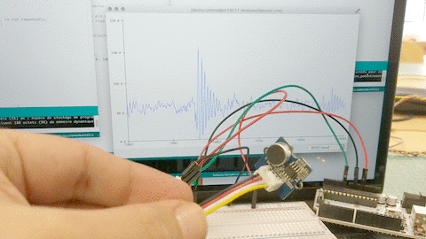
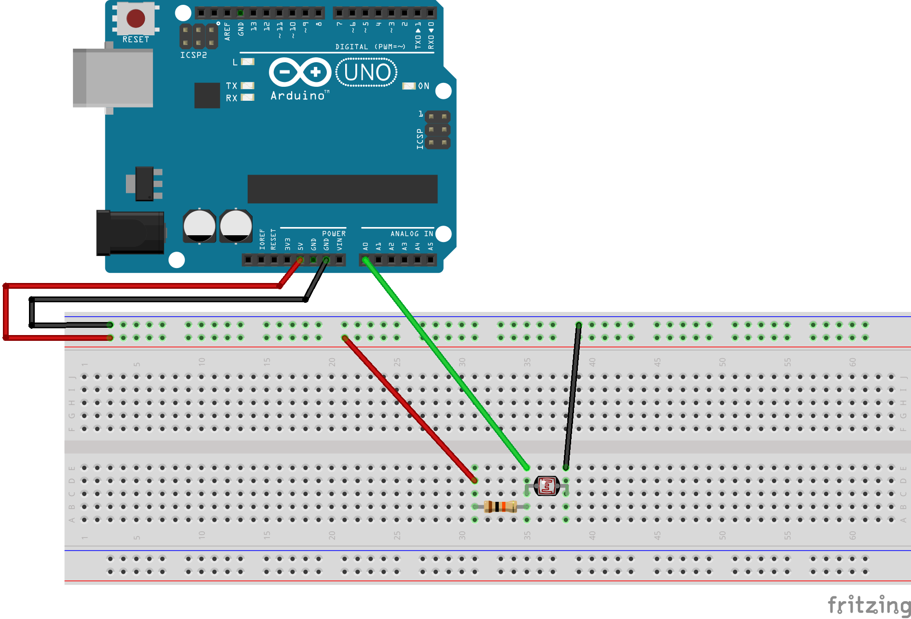
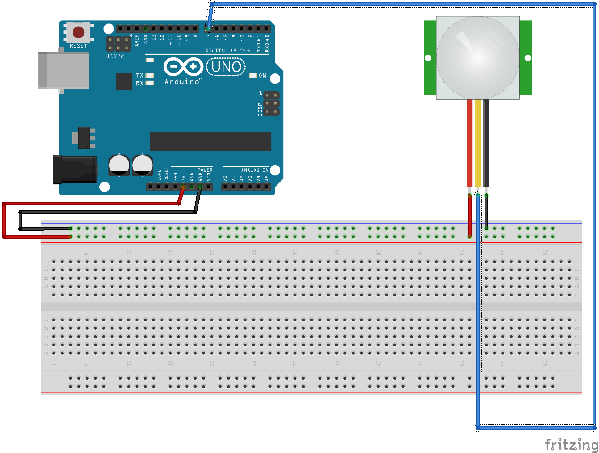
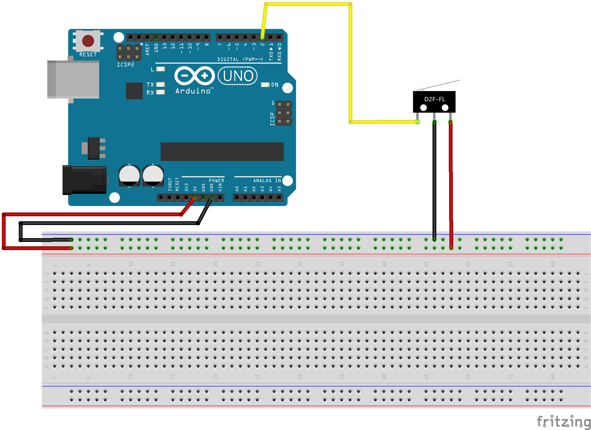

# Introduction Arduino

Code for a creative coding class with arduino for designers.

## CONTENU

* [Connecter des composants et récupérer les valeurs]() 
    * [Potentiomètre]()  
    * [Micro]() 
    * [Photo-résistance]() 
    * [Tilt]() 
    * [FSR]()  
    * [Flex]() 
    * [PIR]() 
    * [Capteur de distance]() 
        * [Infra-rouge]() 
        * [Ultra-son]() 
    * [Microswitch]() 
    * [Accéléromètre]() 
    * [Gyroscope]() 
    
* [Connecter des actuateurs et activer des périphériques]() 
	* [faire tourner servomoteur]() 
        * [sevomoteur classique]() 
        * [servomoteur à rotation continue]() 
	* [allumer des leds (neopixels)]() 
	* [buzzer]() 

* [Controler un actuateur avec un capteur]() 
    * [Utiliser la fonction map()]() 
    * [Potentiomètre vers servo classique]() 
    * [Micro vers servo continu]() 
    * [Flex vers neopixels]() 
    * [Accéléromètre vers buzzer]() 
	

## Connecter des composants et récupérer les valeurs

### Potentiomètre 
 
 

[^home](https://github.com/b2renger/Introduction_arduino#contenu) 

### Micro
 
 

[^home](https://github.com/b2renger/Introduction_arduino#contenu) 

### Photo-résistance
 
 

[^home](https://github.com/b2renger/Introduction_arduino#contenu) 

### Tilt
 
 

[^home](https://github.com/b2renger/Introduction_arduino#contenu) 

### FSR 
 
 

[^home](https://github.com/b2renger/Introduction_arduino#contenu) 

### Flex
 
 

[^home](https://github.com/b2renger/Introduction_arduino#contenu) 

### PIR
 
 

[^home](https://github.com/b2renger/Introduction_arduino#contenu) 

### Capteur de distance

#### Infra-rouge
 
 

[^home](https://github.com/b2renger/Introduction_arduino#contenu) 

#### Ultra-son
 
 

[^home](https://github.com/b2renger/Introduction_arduino#contenu) 

### Microswitch
 
 

[^home](https://github.com/b2renger/Introduction_arduino#contenu) 

### Accéléromètre
 
 

[^home](https://github.com/b2renger/Introduction_arduino#contenu) 

### Gyroscope
 
 

[^home](https://github.com/b2renger/Introduction_arduino#contenu) 

