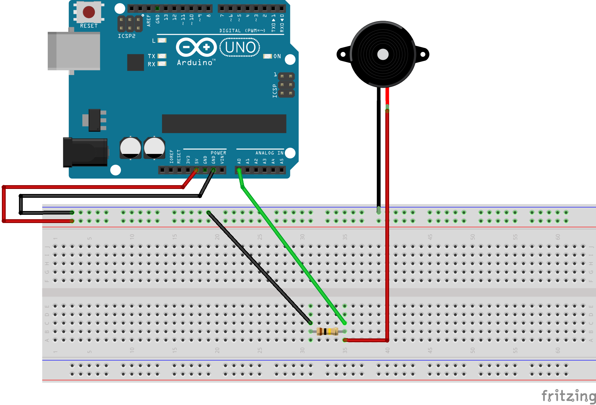
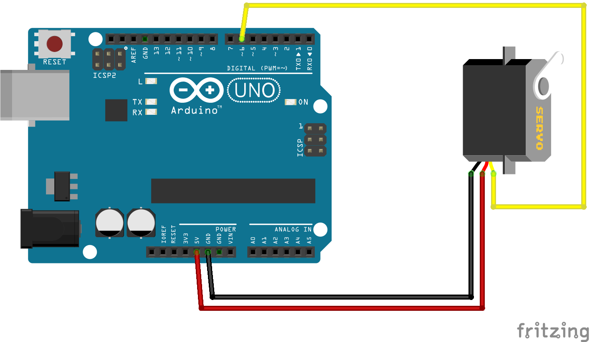
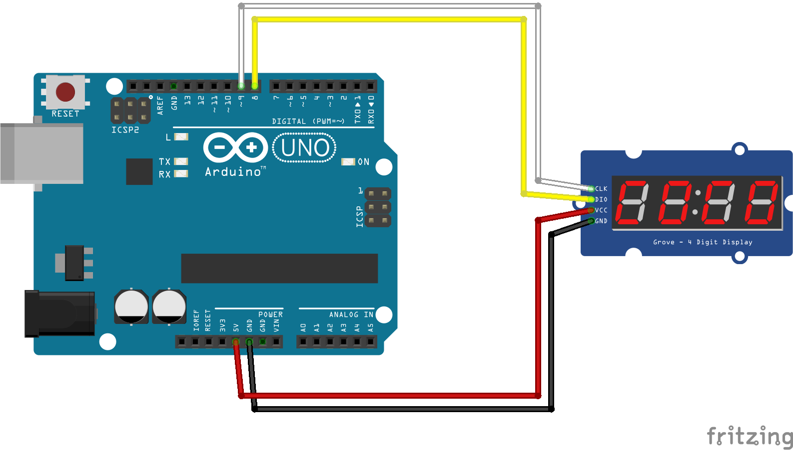
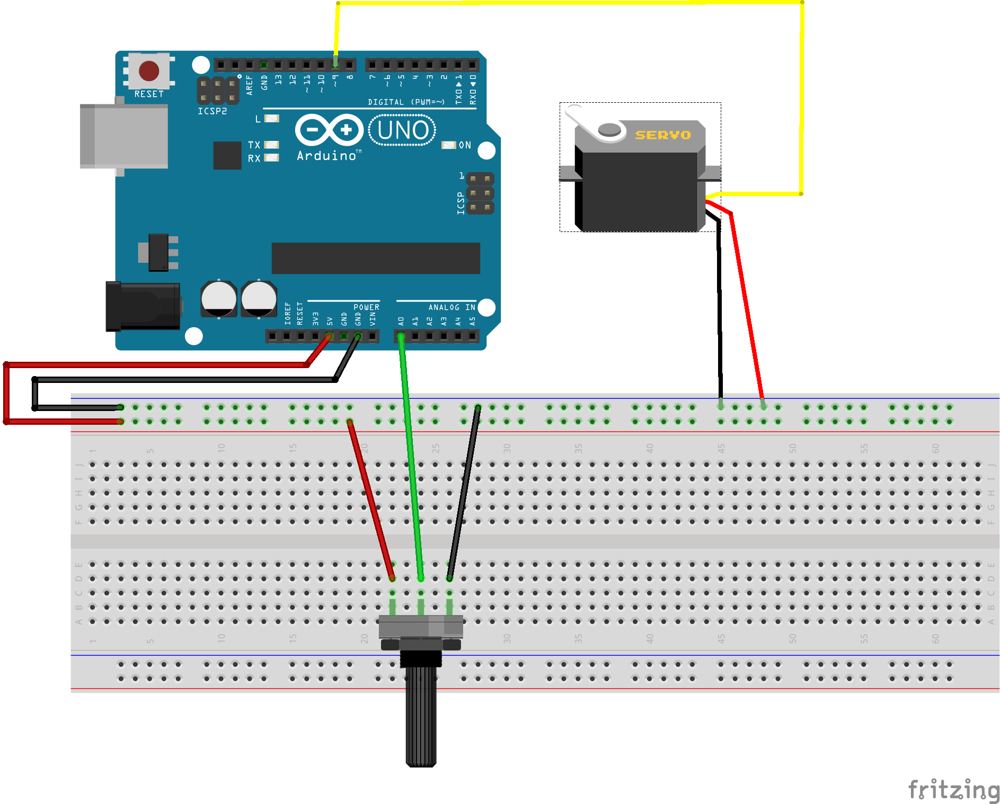
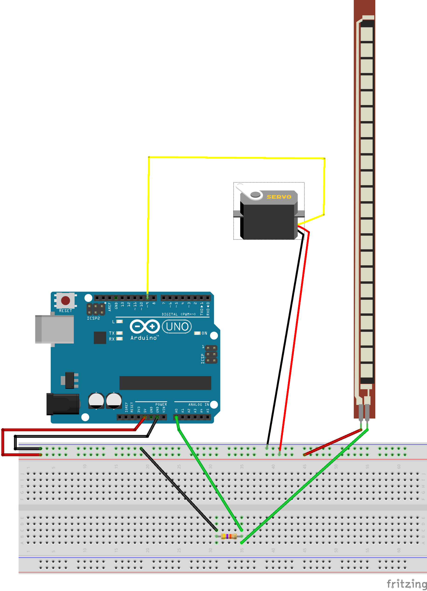

# Introduction Arduino

Code for a creative coding class with arduino for designers.

[Arduino](https://www.arduino.cc/) est une marque de cartes électroniques open hardware : c'est à dire des cartes dont les schémas sont disponibles librement et gratuitement.

Arduino est un projet qui a commencé en 2003 à l'Interaction Design Institute Ivrea (maintenant intégré à la Domus Academy - un école privé de design basée à Milan en Italie) comme un projet pédagogique pour les étudiants cherchant à permettre à coût réduit et d'une manière la plus simple possible de créer des objets interagissant avec leur environnement par le biais de capteurs et d'actuateurs.

Une carte arduino consiste en une plateforme d'entrées / sorties dirigées par un microcontrolleur pouvant être programmé via le logiciel éponyme. Le projet arduino a été est reste très utilisé dans les domaines du prototypage rapide, lié à la programmation multimédia interactive liée à la création de spectacles ou d'installations artistiques numériques.

Les projets réalisés avec ce type de cartes peuvent ensuite être autonomes, connectés à internet (IOT), ou peuvent communiquer directement avec un ou plusieurs ordinateurs.

Ces cartes disposent d'une multitude de composants d'entrées et de sorties, de cartes d'extensions et d'une communauté très active. Arduino est une marque cela signifie qu'il existe des clones de cartes arduino qui ont des caractéristiques très similaires. Nous utiliserons par abus le terme arduino pour définir toute l'activité de créer des circuit et programmer les cartes.

Il existe différent modèles de cartes comportant plus ou moins d'entrées / sorties, qui nécessitent plus ou moins d'énergie pour fonctionner et dont les processeurs (ou micro-controlleurs) sont plus ou moins rapides. (Mega, Leonardo, Uno etc.)

Ici nous allons nous concentrer sur comment récupérer des valeurs de différents capteurs, comment activer des actuateurs et comment faire communiquer une carte arduino et un programme [processing](https://processing.org/).

Chaque exemple comportera un schéma électrique à réaliser et du code à écrire et téléverser sur une carte.  

## CONTENU
* [Introduction](https://github.com/b2renger/Introduction_arduino#introduction)<br>
* [Connecter des capteurs et récupérer les valeurs](https://github.com/b2renger/Introduction_arduino#connecter-des-capteurs-et-r%C3%A9cup%C3%A9rer-les-valeurs)<br>
    * [les entrées analogiques]()<br>
        * [Potentiomètre](https://github.com/b2renger/Introduction_arduino#potentiom%C3%A8tre)<br> 
        * [Micro](https://github.com/b2renger/Introduction_arduino#micro)<br>
        * [Photo-résistance](https://github.com/b2renger/Introduction_arduino#photo-r%C3%A9sistance)<br>
        * [Capteur Piezo](https://github.com/b2renger/Introduction_arduino#capteur-piezo)<br>
        * [Flex](https://github.com/b2renger/Introduction_arduino#flex)<br>    
    * [les entrées digitales]()<br>
        * [PIR](https://github.com/b2renger/Introduction_arduino#pir)<br>
        * [Tilt](https://github.com/b2renger/Introduction_arduino#tilt)<br>
        * [FSR](https://github.com/b2renger/Introduction_arduino#fsr)<br> 
        * [Microswitch](https://github.com/b2renger/Introduction_arduino#microswitch)<br>
    * [Capteurs de distance](https://github.com/b2renger/Introduction_arduino#capteur-de-distance)<br>
        * [Infra-rouge](https://github.com/b2renger/Introduction_arduino#infra-rouge)<br>
        * [Ultra-son](https://github.com/b2renger/Introduction_arduino#ultra-son)<br>
    * [Capteurs numériques - entrée SDA et SCL]()<br>
        * [Accéléromètre](https://github.com/b2renger/Introduction_arduino#acc%C3%A9l%C3%A9rom%C3%A8tre)<br>
        * [Gyroscope](https://github.com/b2renger/Introduction_arduino#gyroscope)<br>
        * [Gesture](https://github.com/b2renger/Introduction_arduino#gesture)<br>
    
* [Connecter des actuateurs et activer des périphériques](https://github.com/b2renger/Introduction_arduino#connecter-des-actuateurs-et-activer-des-p%C3%A9riph%C3%A9riques)<br>
	* [faire tourner servomoteur](https://github.com/b2renger/Introduction_arduino#servomoteurs)<br>
        * [sevomoteur classique](https://github.com/b2renger/Introduction_arduino#servomoteur-classique)<br>
        * [servomoteur à rotation continue](https://github.com/b2renger/Introduction_arduino#servomoteur-%C3%A0-rotatoin-continue)<br>
        * [servomoteur linéaire](https://github.com/b2renger/Introduction_arduino#servomoteur-lin%C3%A9aire)<br>
	* [allumer des leds (neopixels)](https://github.com/b2renger/Introduction_arduino#alumer-des-leds-neopixels)<br>
        * [RGB](https://github.com/b2renger/Introduction_arduino#sp%C3%A9cifier-la-couleur-en-rgb)<br>
        * [HSB](https://github.com/b2renger/Introduction_arduino#sp%C3%A9cifier-la-couleur-en-hsv)<br>
    * [utiliser un afficheur à digits](https://github.com/b2renger/Introduction_arduino#utiliser-un-afficheur-%C3%A0-4-digits)<br>
	
* [Controler un actuateur avec un capteur](https://github.com/b2renger/Introduction_arduino#controler-un-actuateur-avec-un-capteur)<br>
    * [Utiliser la fonction map()]<br>
    * [Potentiomètre vers servo classique](https://github.com/b2renger/Introduction_arduino#potentiom%C3%A8tre-vers-servo-classique)<br>
    * [Flex vers servo continu](https://github.com/b2renger/Introduction_arduino#flex-vers-servo-continu)<br>
    * [FSR vers neopixels HSB](https://github.com/b2renger/Introduction_arduino#fsr-vers-neopixels-hsb)<br>

* [Utiliser des capteurs pour contrôler du code processing](https://github.com/b2renger/Introduction_arduino#utiliser-des-capteurs-pour-contr%C3%B4ler-du-code-processing)<br>
    * [Controler le playback d'une vidéo avec un capteur de distance](https://github.com/b2renger/Introduction_arduino#controler-le-playback-dune-vid%C3%A9o-avec-un-capteur-de-distance)<br>
    * [Controler une animation avec une photoresistance](https://github.com/b2renger/Introduction_arduino#controler-une-animation-avec-une-photoresistance)<br>
    * [Controler des leds neopixels avec la souris](https://github.com/b2renger/Introduction_arduino#controler-des-leds-neopixels-avec-la-souris)<br>

## Introduction

Lorsque l'on dit qu'une carte arduino est une carte d'entrée / sortie cela signifie que cette carte peut mesurer des courants électriques (entrée) ou générer des courants électrique (sortie).

Mesurer des courants permet de brancher des capteurs et de vérifier leur état : par exemple mesurer le courant en sortie d'un capteur de luminosité nous permet d'avoir une estimation de la luminosité ambiante.

Générer des courants permet de brancher des actuateurs et donc de faire tourner un moteur plus ou moins vite ou d'allumer des leds plus ou moins fort. C'est l'écriture de code qui va permettre de prévoir l'interaction et les lien entres nos différents éléments.

Une carte arduino ressemble à ceci :

<br>

Essayez de répérer sur la partie de gauche les **entrées analogiques** numérotées de **A0** jusqu'à **A5**, sur la droite vous pourrez trouver les **pins digitales** numérotées de 0 à 13.

Remarquez que nous parlons d'*entrées* analogiques et de *pins* digitales. Pour résumer A0 jusqu'à A5 sont des entrées et uniquement des entrées; de plus elles sont *analogiques* ce qui signifie que vous pourront y mesurer des valeurs comprises entre 0 et 1023.

Les *pins* digitales peuvent elles être utilisées soit en tant qu'entrées ou en tant que sorties (cela se précise dans le code que nous écrirons) et ne manipulent que des 0 et des 1 (un signal numérique ou digital) - même si cela n'est pas tout à fait vrai car certaines on un petit tilde **~** représenté avant leur numéro, cela signifie que ces *pins* peuvent générer un signal PWM (pulse width modulation) mais c'est une autre histoire et nous en reparlerons ultérieurement.

Il est important de répérer aussi les pins notées **5V** et **GND** celles-ci correspondent au pins d'alimentation. Chaque composant doit être alimenté en électricité et nous les utiliserons donc systématiquement.

Pour simplifier les choses éviter des connecter des capteurs sur les pins digitales D0 et D1 au début.

Lorsque l'on a pu brancher des composants sur notre carte, nous allons utiliser du code pour mesurer des courants : **lire** sur une entrée **digitale** ou sur en entrée **analogique**, ou **écrire** sur une sortie **digitale**.

Le code s'écrit dans l'IDE (Integrated Development Environment) arduino, que vous pourrez trouver et télécharger à cette adresse : https://www.arduino.cc/en/Main/Software

Il faut prendre la version *Desktop* :

<br>

Un fois téléchargé, installé et ouvert vous devrier vous retrouver devant une fenêtre ressemblant à cela :

<br>

Nous allons donc taper du texte dans cette page pour programmer notre carte électronique.

Les deux premiers boutons en haut à gauche permettent de **vérifier** et de **téléverser** votre code vers la carte, les boutons suivant servent à créer un nouveau programme, ouvrir un programme ou enregistrer un programme, et le bouton tout à droite sert à ouvrir le **moniteur série** (c'est ici que notre programme pourra écrire des informations pour nous informer sur le bon déroulement de la tâche ou pou observer des valeurs brutes de capteurs).

La zone noire correspond à la **console d'erreurs** : le logiciel nous indiquera ici (et souvent en rouge) lorsqu'il y a des erreurs dans le programme que nous avons écrit, ou des problèmes de communication avec la carte.

Finalement la zone blanche est la zone de code. Vous pouvez y voir deux fonctions déjà tappées **setup()** et **loop()**. Ceci est la structure basique de n'importe quel programme arduino. 

Entre les accolades qui délimitent la fonction **setup()** vous écrirez du code qui ne sera exécuté qu'une seul fois au début de votre programme. Par exemple ouvrir une communication série avec notre ordinateur :

```
void setup() {
  // put your setup code here, to run once:
  Serial.begin(9600);
}
```

Et entre les accolades qui délimitent la fonction **loop()** vous écrirez du code qui sera exécuté en boucle une fois le programme démarré. Par exemple imprimmer dans le moniteur série la valeur lue sur l'entrée analogique 0 :

```
void loop() {
  // put your main code here, to run repeatedly:
  Serial.println(analogRead(0));
}
```
Pensez bien que qu'il faut tapper les instructions exactement comme la carte arduino les attend, la moindre faute de frappe (sur une majuscule, un point virgule ou une parenthèse manquante) fera que votre programme ne fonctionnera pas, car la carte ne sera pas capable de comprendre les instructions qu'elle doit exécuter.

Remarquez qu'il est possible d'écrire des commentaires en langage pour humain : en plaçant **//** devant une ligne celle-ci ne sera pas lue / exécutée par la carte.

Une fois le programme écrit il faut le **téléverser** sur la carte mais avant il faut préciser sur quelle **type de carte** on veut téléverser le programme et dire précisément la carte ou le **port** sur laquelle on veut téléverser - car on pourrait très bien avoir plusieurs cartes connectées à notre ordinateur.

Pour cela il faut aller dans le menu *Outils* puis sélectionner *Arduino / Genuino Uno* pour le **type de carte** et choisir la bonne carte dans le menu **Port** (il faut bien sûr à ce stade que votre carte soit branchée à un port usb de votre ordinateur) :

<br>

Une fois cela fait vous pouvez **vérifier** votre programme puis le **téléverser**.

Lorsque l'on réalise un circuit notre carte doit être déconnectée de notre ordinateur, au moment où l'on code il est préférable de la garder connectée.


## Connecter des capteurs et récupérer les valeurs

### Entrées Analogiques

```

```
#### Potentiomètre 
<br>
<br>

[^home](https://github.com/b2renger/Introduction_arduino#contenu)<br>

#### Micro
<br>
<br>

[^home](https://github.com/b2renger/Introduction_arduino#contenu)<br>

#### Photo-résistance
<br>
<br>

[^home](https://github.com/b2renger/Introduction_arduino#contenu)<br>

#### Capteur Piezo
<br>
<br>

[^home](https://github.com/b2renger/Introduction_arduino#contenu)<br>

#### FSR 
<br>
<br>

[^home](https://github.com/b2renger/Introduction_arduino#contenu)<br>

#### Flex
<br>
<br>

[^home](https://github.com/b2renger/Introduction_arduino#contenu)<br>

### Entrées Digitales

#### Tilt
<br>
<br>

[^home](https://github.com/b2renger/Introduction_arduino#contenu)<br>

#### PIR
<br>
<br>

[^home](https://github.com/b2renger/Introduction_arduino#contenu)<br>

### Microswitch
<br>
<br>

[^home](https://github.com/b2renger/Introduction_arduino#contenu)<br>

### Capteurs de distance

#### Infra-rouge
<br>
<br>

[^home](https://github.com/b2renger/Introduction_arduino#contenu)<br>

#### Ultra-son
<br>
<br>

[^home](https://github.com/b2renger/Introduction_arduino#contenu)<br>

### Capteurs numériques - SDA et SCL

#### Accéléromètre
<br>
<br>

[^home](https://github.com/b2renger/Introduction_arduino#contenu)<br>

#### Gyroscope
<br>
<br>

[^home](https://github.com/b2renger/Introduction_arduino#contenu)<br>

#### Gesture
<br>
<br>

[^home](https://github.com/b2renger/Introduction_arduino#contenu)<br>


## Connecter des actuateurs et activer des périphériques

### Servomoteurs
D'une manière générale tous les servomoteurs se branchent de le même façon :

<br>

Le code est aussi le même on envoit une valeur :
- 90 pour la position de repos
- 0 pour un des deux comportements / position extême
- 180 pour l'autre

#### Servomoteur classique
<br>

#### Servomoteur à rotatoin continue
<br>

#### Servomoteur linéaire
<br>

[^home](https://github.com/b2renger/Introduction_arduino#contenu)<br>


### Alumer des leds (neopixels)

<br>

Nous allons utiliser la bibliothèque Fast-LED.

#### Spécifier la couleur en RGB

<br>


#### Spécifier la couleur en HSV

<br>

[^home](https://github.com/b2renger/Introduction_arduino#contenu)<br>

### Utiliser un afficheur à 4 digits

<br>
<br>


[^home](https://github.com/b2renger/Introduction_arduino#contenu)<br>


## Controler un actuateur avec un capteur

### Utiliser la fonction map()


[^home](https://github.com/b2renger/Introduction_arduino#contenu)<br>

### Potentiomètre vers servo classique

<br>
<br>

[^home](https://github.com/b2renger/Introduction_arduino#contenu)<br>

### Flex vers servo continu

<br>
<br>

[^home](https://github.com/b2renger/Introduction_arduino#contenu)<br>

### FSR vers neopixels HSB

<br>
<br>

[^home](https://github.com/b2renger/Introduction_arduino#contenu)<br>

## Utiliser des capteurs pour contrôler du code processing

### Controler le playback d'une vidéo avec un capteur de distance

<br>
<br>

[^home](https://github.com/b2renger/Introduction_arduino#contenu)<br>

### Controler une animation avec une photoresistance

<br>
<br>

[^home](https://github.com/b2renger/Introduction_arduino#contenu)<br>

### Controler des leds neopixels avec la souris

<br>
<br>

[^home](https://github.com/b2renger/Introduction_arduino#contenu)<br>