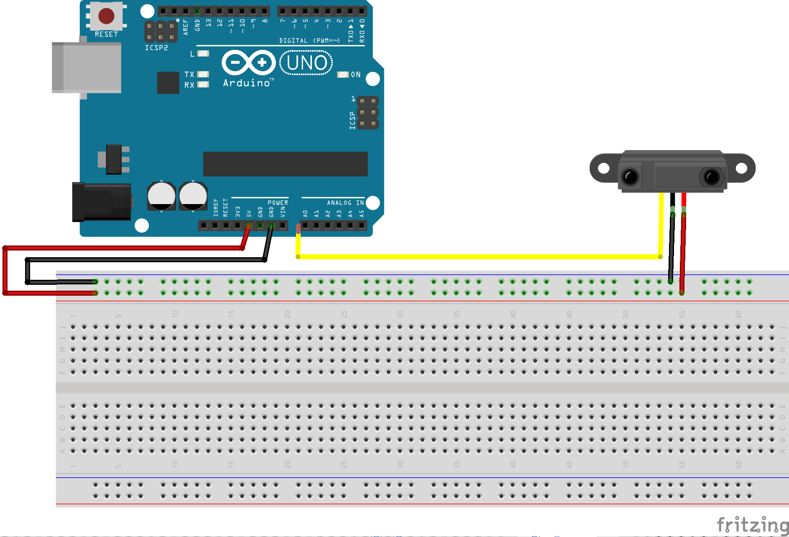

# Introduction Arduino

Code for a creative coding class with arduino for designers. English wip : [here](https://github.com/b2renger/Introduction_Arduino/blob/english/README.md)

Cette ressource est dédié à arduino et arduino seulement. Il s'agit d'un catalogue de capteurs et d'actuateur avec des schémas de branchement et du code minimaliste pour les faire fonctionnner. A la fin est présente un peu de logique de code.

Soit :
- vous ne connaissez pas arduino : à ce moment là il est préférable de lire l'introduction, puis il est temps d'expérimenter en choisissant un capteur/actionneur par catégorie en essayant de les faire fonctionner comme cela est montré dans les gifs, après cela il est temps d'essayer de faire fonctionner un capteur et un actionneur conjointement (en utilisant map ou des if : par exemple allumer des leds quand on appuie sur un bouton) comme cela est expliqué à la fin de cette ressource).
- vous connaissez arduino et du coup vous pouvez juste chercher le capteur/actionneur qui vous intéresse et reproduire le schéma et le code !

Si vous êtes intéressé par la communication entre cartes arduino ou la communication arduino et d'autres logiciels vous pouvez aller consulter cette ressource :  https://github.com/b2renger/Arduino_communication  (encore en developpement).

Amusez vous bien !


[Arduino](https://www.arduino.cc/) est une marque de cartes électroniques open hardware : c'est à dire des cartes dont les schémas sont disponibles librement et gratuitement.

Arduino est un projet qui a commencé en 2003 à l'Interaction Design Institute Ivrea (maintenant intégré à la Domus Academy - un école privé de design basée à Milan en Italie) comme un projet pédagogique pour les étudiants cherchant à permettre à coût réduit et d'une manière la plus simple possible de créer des objets interagissant avec leur environnement par le biais de capteurs et d'actuateurs.

Une carte arduino consiste en une plateforme d'entrées / sorties dirigées par un microcontrolleur pouvant être programmé via le logiciel éponyme. Le projet arduino a été est reste très utilisé dans les domaines du prototypage rapide, lié à la programmation multimédia interactive liée à la création de spectacles ou d'installations artistiques numériques.

Les projets réalisés avec ce type de cartes peuvent ensuite être autonomes, connectés à internet (IOT), ou peuvent communiquer directement avec un ou plusieurs ordinateurs.

Ces cartes disposent d'une multitude de composants d'entrées et de sorties, de cartes d'extensions et d'une communauté très active. Arduino est une marque cela signifie qu'il existe des clones de cartes arduino qui ont des caractéristiques très similaires. Nous utiliserons par abus le terme arduino pour définir toute l'activité de créer des circuit et programmer les cartes.

Il existe différent modèles de cartes comportant plus ou moins d'entrées / sorties, qui nécessitent plus ou moins d'énergie pour fonctionner et dont les processeurs (ou micro-controlleurs) sont plus ou moins rapides. (Mega, Leonardo, Uno etc.)

Ici nous allons nous concentrer sur comment récupérer des valeurs de différents capteurs, comment activer des actuateurs et comment faire communiquer une carte arduino et un programme [processing](https://processing.org/).

Chaque exemple comportera un schéma électrique à réaliser et du code à écrire et téléverser sur une carte. La première partie consiste en un petit inventaire de capteurs, la deuxième présentera quelques actuateurs (moteurs , leds et afficheur à digits), la troisième partie elle consistera à récupérer l'information d'un capteurs pour la transmettre à un actuateur, et finalement la quatrième partie nous amenera à faire communiquer notre ordinateur avec notre carte arduino.

Vous pourrez retrouver l'ensemble des explications ainsi que les code d'exemples prêt à télécharger sur ce dépôt [github](https://github.com/b2renger/Introduction_Arduino/)

## Contenu
* [Introduction](#Introduction)<br>

* [Connecter des capteurs et mesurer des valeurs](#Connecter-des-capteurs-et-mesurer-des-valeurs)<br>

    * [Les broches Digitales et capteurs logiques](#Les-broches-Digitales-et-capteurs-logiques)<br>
        * [Tilt](#Tilt)<br>   
        * [PIR](#PIR)<br>  
        * [Microswitch](#Microswitch)<br>
        * [Bouton](#Bouton)<br>

    * [Les broches analogiques](#Les-broches-analogiques)<br>
        * [Potentiometre](#Potentiometre)<br> 
        * [Microphone](#Microphone)<br>
        * [Photo-resistance](#Photo-resistance)<br>
        * [Capteur piezo](#Capteur-piezo)<br>
        * [Flex](#Flex)<br>    
        * [FSR](#FSR)<br>

    * [Capteurs de distance](#Capteurs-de-distance)<br>
        * [Infra-rouge](#Infra-rouge)<br>
        * [Ultra-son](#Ultra-son)<br>
          * [Ultra-son grove](#Ultra-son-grove)<br>
          * [Ultra-son hc sr04](#Ultra-son-hc-sr04)<br>

    * [Capteurs digitaux et broches SDA-SCL](#Capteurs-digitaux-et-broches-SDA-SCL)<br>
        * [Accelerometre](#Accelerometre)<br>
        * [Gyroscope](#Gyroscope)<br>
        * [Gesture](#Gesture)<br>
        * [RFID](#Rfid)<br>
    
* [Connecter des actuateurs et agir sur le monde](#Connecter-des-actuateurs-et-agir-sur-le-monde)<br>

  * [Allumer des leds](#Allumer-des-leds)<br>
    * [Faire clignoter des leds](#Faire-clignoter-des-leds)<br>
    * [Faire varier des leds](#Faire-varier-des-leds)<br>

    
  * [Allumer des leds neopixel](#Allumer-des-leds-neopixel)<br>
      * [RGB](#RGB)<br>
      * [HSB](#HSB)<br>

  * [Activer un vibreur](#Activer-un-vibreur)<br>
    * [Vibreur on-off](#Vibreur-on-off)<br>
    * [Vibreur variation](#Vibreur-variation)<br>

  * [Faire tourner un servomoteur](#Faire-tourner-un-servomoteur)<br>
      * [Servomoteur classique](#Servomoteur-classique)<br>
      * [Servomoteur rotation continue](#Servomoteur-rotation-continue)<br>
      * [Servomoteur lineaire](#Servomoteur-lineaire)<br>
      * [Servomoteur mouvement avec easing](#ServoEasing)<br>

 * [Faire tourner un stepper](#Faire-tourner-un-stepper)<br>
      * [Un stepper](#Un-stepper)<br>
      * [Deux steppers ou plus](#Deux-steppers-ou-plus)<br>

  * [Utiliser un afficheur 7 segments](#Utiliser-un-afficheur-7-segments)<br>
	
* [Controler un actuateur avec un capteur](#Controler-un-actuateur-avec-un-capteur)<br>
    * [Utiliser la fonction map()](#Utiliser-la-fonction-map())<br>
    * [Potentiometre et servo classique](#Potentiometre-et-servo-classique)<br>
    * [Flex et servo continu](#Flex-et-servo-continu)<br>
    * [FSR et neopixels](#FSR-et-neopixels)<br>


## Introduction

Lorsque l'on dit qu'une carte arduino est une carte d'entrée / sortie cela signifie que cette carte peut mesurer des courants électriques (entrée) ou générer des courants électrique (sortie).

Mesurer des courants permet de brancher des capteurs et de vérifier leur état : par exemple mesurer le courant en sortie d'un capteur de luminosité nous permet d'avoir une estimation de la luminosité ambiante.

Générer des courants permet de brancher des actuateurs et donc de faire tourner un moteur plus ou moins vite ou d'allumer des leds plus ou moins fort. C'est l'écriture de code qui va permettre de prévoir l'interaction et les lien entres nos différents éléments.

Une carte arduino ressemble à ceci :

<br>

Essayez de répérer sur la partie de gauche les **entrées analogiques** numérotées de **A0** jusqu'à **A5**, sur la droite vous pourrez trouver les **pins digitales** numérotées de 0 à 13.

Remarquez que nous parlons d'*entrées* analogiques et de *pins* digitales. Pour résumer A0 jusqu'à A5 sont des entrées et uniquement des entrées; de plus elles sont *analogiques* ce qui signifie que vous pourront y mesurer des valeurs comprises entre 0 et 1023.

Les *pins* digitales peuvent elles être utilisées soit en tant qu'entrées ou en tant que sorties (cela se précise dans le code que nous écrirons) et ne manipulent que des 0 et des 1 (un signal numérique ou digital) - même si cela n'est pas tout à fait vrai car certaines on un petit tilde **~** représenté avant leur numéro, cela signifie que ces *pins* peuvent générer un signal PWM (pulse width modulation) mais c'est une autre histoire et nous en reparlerons ultérieurement.

Il est important de répérer aussi les pins notées **5V** et **GND** celles-ci correspondent au pins d'alimentation. Chaque composant doit être alimenté en électricité et nous les utiliserons donc systématiquement.

Pour simplifier les choses éviter des connecter des capteurs sur les pins digitales D0 et D1 au début.

Lorsque l'on a pu brancher des composants sur notre carte, nous allons utiliser du code pour mesurer des courants : **lire** sur une entrée **digitale** ou sur en entrée **analogique**, ou **écrire** sur une sortie **digitale**.

Le code s'écrit dans l'IDE (Integrated Development Environment) arduino, que vous pourrez trouver et télécharger à cette adresse : https://www.arduino.cc/en/Main/Software

Il faut prendre la version *Desktop* :

<br>

Un fois téléchargé, installé et ouvert vous devrier vous retrouver devant une fenêtre ressemblant à cela :

<br>

Nous allons donc taper du texte dans cette page pour programmer notre carte électronique.

Les deux premiers boutons en haut à gauche permettent de **vérifier** et de **téléverser** votre code vers la carte, les boutons suivant servent à créer un nouveau programme, ouvrir un programme ou enregistrer un programme, et le bouton tout à droite sert à ouvrir le **moniteur série** (c'est ici que notre programme pourra écrire des informations pour nous informer sur le bon déroulement de la tâche ou pou observer des valeurs brutes de capteurs).

La zone noire correspond à la **console d'erreurs** : le logiciel nous indiquera ici (et souvent en rouge) lorsqu'il y a des erreurs dans le programme que nous avons écrit, ou des problèmes de communication avec la carte.

Finalement la zone blanche est la zone de code. Vous pouvez y voir deux fonctions déjà tappées **setup()** et **loop()**. Ceci est la structure basique de n'importe quel programme arduino. 

Entre les accolades qui délimitent la fonction **setup()** vous écrirez du code qui ne sera exécuté qu'une seul fois au début de votre programme. Par exemple ouvrir une communication série avec notre ordinateur :

```c
void setup() {
  // put your setup code here, to run once:
  Serial.begin(9600);
}
```

Et entre les accolades qui délimitent la fonction **loop()** vous écrirez du code qui sera exécuté en boucle une fois le programme démarré. Par exemple imprimmer dans le moniteur série la valeur lue sur l'entrée analogique 0 :

```c
void loop() {
  // put your main code here, to run repeatedly:
  Serial.println(analogRead(0));
}
```
Pensez bien que qu'il faut tapper les instructions exactement comme la carte arduino les attend, la moindre faute de frappe (sur une majuscule, un point virgule ou une parenthèse manquante) fera que votre programme ne fonctionnera pas, car la carte ne sera pas capable de comprendre les instructions qu'elle doit exécuter.

Remarquez qu'il est possible d'écrire des commentaires en langage pour humain : en plaçant **//** devant une ligne celle-ci ne sera pas lue / exécutée par la carte.

Une fois le programme écrit il faut le **téléverser** sur la carte mais avant il faut préciser sur quelle **type de carte** on veut téléverser le programme et dire précisément la carte ou le **port** sur laquelle on veut téléverser - car on pourrait très bien avoir plusieurs cartes connectées à notre ordinateur.

Pour cela il faut aller dans le menu *Outils* puis sélectionner *Arduino / Genuino Uno* pour le **type de carte** et choisir la bonne carte dans le menu **Port** (il faut bien sûr à ce stade que votre carte soit branchée à un port usb de votre ordinateur) :

<br>

Une fois cela fait vous pouvez **vérifier** votre programme puis le **téléverser**.

Lorsque l'on réalise un circuit notre carte doit être déconnectée de notre ordinateur, au moment où l'on code il est préférable de la garder connectée.

[**home**](#Contenu)<br>


## Connecter des capteurs et mesurer des valeurs 

Cette première partie consiste en un petit inventaire de capteurs. Vous disposerez à chaque fois d'un montage et de code pour lire la valeur du capteurs et l'imprimer dans le moniteur série.

En terme de code nous utiliserons principalement deux fonctions : 
- [**digitalRead()**](https://www.arduino.cc/reference/en/language/functions/digital-io/digitalread/) permettant de **lire** une valeur d'une entrée **digitale**.
- [**analogRead()**](https://www.arduino.cc/reference/en/language/functions/analog-io/analogread/) permettant de **lire** une valeur d'une entrée **analogique**.

Plus les commandes liées au moniteur série :    
- [**Serial.begin()**](https://www.arduino.cc/en/Serial/Begin) qui permet d'ouvrir une connexion série via le cable USB (pour rappel le sigle usb signifie Universal Serial Bus) pour récuperer des valeurs dans notre ordinateur.
- [**Serial.println()**](https://www.arduino.cc/reference/en/language/functions/communication/serial/print/) qui permet d'inscrire des valeurs dans le port série.

D'une manière générale le code sera toujours le même et il consistera en :

- ouvrir une connexion série pour pouvoir écrire les valeurs du capteurs sur notre ordinateur.
- lire la valeur reçue depuis une pin précise.
- l'écrire dans le moniteur série.

D'un point de vue électronique, parfois nous allons utiliser des résistances et des fois non. Le principe d'une résistance est de permettre de dissiper un peu le courant qui parcourt notre montage. Il en existe de différentes valeurs de quelques ohms à plusieurs million d'ohms, plus la valeur est grande plus elles vont dissiper le courant car à tension constante : **U = R * I**, il s'agit de la **loi d'ohms**; soit la tension est égale à la résistance fois l'intensité - par conséquent l'intensité est égale à la tension divisée par la résistance.

En fonction du courant requis pour un fonctionnement optimal de nos capteurs, nous deverons choisir une résistance adaptée.

[**home**](#Contenu)<br>

### Les broches Digitales et capteurs logiques

Les entrées digitales sont au nombre de 13. Typiquement une pin digitale ne va mesurer que deux type de courant : soit il y a du courant, soit il n'y en a pas / *HIGH* ou *LOW* / 1 ou 0 / *True* ou *False*.

#### Tilt

Le capteur *tilt* permet de détecter des changement brusques de mouvement ou des changments d'orientation. D'une manière une petite bille va rentrer en contact avec la paroi et ainsi fermer un ciruit et ainsi laisser passer le courant. 

Voici à quoi il ressemble : 

<br>

Une patte reliée à la masse l'autre va être relié à du courant, si la bille et le corps du capteur rentrent en contact le courant passe et on peut donc le mesurer; on obtient donc soit un 1 soit un 0 en fonction de l'état du capteur.

Exemple d'utilisation :

<br>


Le circuit à réaliser :

<br>

Ici nous utilisons un résistance de 10 kilo ohms, pour protéger notre capteur et notre carte : cela nous permet d'abaisser le courant circulant dans nos fils avant de le mesurer. 

Le code est très simple, nous devons : 

- ouvrir une connexion série pour pouvoir écrire les valeurs du capteurs.
- préciser à notre programme que nous utilisons la pin 7 comme une entrée.
- lire la valeur reçue sur la pin 7.
- l'écrire dans le moniteur série.

Les deux premières étapes ne peuvent être effectuées qu'une seule fois à la mise sous tension de la carte : elles iront donc dans le **setup()**; les deux étapes suivante doivent être effectuées en boucle pour toujours actualiser la valeur lue sur le capteur  elles iront donc dans le **loop()**.


```c
void setup() {
  Serial.begin(9600); // ouvrir la connexion série
  pinMode(7, INPUT); // préciser que la pin 7 va être utilisée comme une entrée
}

void loop() {
  int value = digitalRead(7); // lire la valeur sur la pin 7 et la stocker dans une variable entière
  Serial.println(value); // imprimmer le contenu de la variable dans le moniteur série
}
```

[**home**](#Contenu)<br>

#### PIR

Le capteur [*PIR*](https://en.wikipedia.org/wiki/Passive_infrared_sensor) est un capteur de Présence à Infra Rouge, il permet de détecter la présence de quelque'un avec un champ de vision qui lui est propre. Ce sont typiquement des capteurs dans tous les lieux publiques dont les lumières s'allument automatiquement.

Ces capteurs renvoient un 1 pendant un temps déterminé (ici 3 secondes) lorsqu'ils détectent une présence et 0 sinon. 

<br>

Ici au lieu d'ouvir le **moniteur série**, le résultat est affiché dans le **traceur série** disponible via le menu *Outils* -> *Traceur série*.

Le *PIR* est souvent accompagné d'un petit circuit imprimmé et il n'est donc pas nécessaire d'ajouter de résistance car cela a souvent déjà été fait sur la carte accompagnant le capteur.

<br>

Le code est identique au code précédent si nous avons bien aussi branché le capteur *PIR* sur l'entrée 7 : 

```c
void setup() {
  Serial.begin(9600); // ouvrir la connexion série
  pinMode(7, INPUT); // préciser que la pin 7 va être utilisée comme une entrée
}

void loop() {
  int value = digitalRead(7); // lire la valeur sur la pin 7 et la stocker dans une variable entière
  Serial.println(value); // imprimmer le contenu de la variable dans le moniteur série
}
```

[**home**](#Contenu)<br>

#### Microswitch

Le microswitch est de la même famille que les interupteurs ou les boutons. Lorsque l'on appuie dessus le circuit est fermé, on peut alors mesurer un 1 - sinon le circuit est ouvert et il n'y a pas de courant qui passe on mesure alors un 0.

<br>

<br>

Encore une fois le code est identique sauf que notre composant est branché pour sur l'entrée digitale 2
```c
void setup() {
  Serial.begin(9600); // ouvrir la connexion série
  pinMode(2, INPUT); // préciser que la pin 2 va être utilisée comme une entrée
}

void loop() {
  int value = digitalRead(2); // lire la valeur sur la pin 2 et la stocker dans une variable entière
  Serial.println(value); // imprimmer le contenu de la variable dans le moniteur série
}
```

[**home**](#Contenu)<br>

#### Bouton

Les boutons peuvent apparaitrent aux premiers abords comme le composant le plus simple à utiliser, mais ce n'est pas réellement le cas - il est conseillé de commencer par utiliser le microswitch avant de passer au bouton. Le montage peut s'avérer compliqué (surtout lorsque l'on souhaite en avoir plusieurs) et le code n'est pas forcément le plus simple - nous sommes habitués naturellement à avoir différents types d'interactions avec un bouton qui demandent parfois un peu d'expertise.

Les boutons existent de différentes tailles et de différentes formes, ils peuvent avoir 2, 3 ou 4 pattes mais le principe est toujours le même : lorsque l'on appuie sur le bouton, le circuit se ferme et donc le courant peut passer. En mesurant ce courant sur une broche digitale on obtient soit un 0 (circuit ouvert = pas de courant) ou un 1 (circuit fermé = le courant passe). Il est possible d'obtenir des comportement plus complexes que cette simple lecture et de "reconnaitre" des doubles clicks, appuis longs etc. à l'aide d'une bibliothèque.

<br>

Le bouton d'arcade dispose de 3 broches, le petit bouton en bas à droite de 4 et le bouton en bas à gauche dispose de 3 broches aussi (il s'agit d'un bouton capacitif). 

Le circuit électronique est sensiblement le même pour tous les boutons : il est préférable de faire un montage en branchant le bouton avec 3 fils : 2 pour l'alimentation (noir et rouge) avec une résistance de 10kohms sur la masse, et un fil (jaune) pour la lecture de la valeur. Le bouton capacitif grove est déjà monté sur une petite carte disposant d'une résistance intégrée.

[**home**](#Contenu)<br>

#### Circuits

##### Le bouton capacitif

<br>

##### Le bouton "classique"

<br>

##### Le bouton d'arcade

<br>


#### Code
Contrairement aux composants précédents il y aura deux exemples de code pour deux comportements distincts. 
- Le premier se contentera de lire les données sur la broche 2. La valeur lue vaudra donc 0 si le bouton n'est pas appuyé et 1 s'il l'est.
- Le second manipulera une variable afin de la faire changer d'état. Ainsi à chaque fois que nous cliquerons sur le bouton (cela signifie ici appuyer et relacher), une variable changera d'état pour valoir soit 0 soit 1.

<br>

#### Lire la valeur d'un bouton

```c
void setup() {
  Serial.begin(9600); // ouvrir la connection série
  pinMode(2, INPUT); // préciser que la pin 2 va être utilisée comme une entrée
}

void loop() {
  int value = digitalRead(2); // lire la valeur sur la pin 2 et la stocker dans une variable entière
  Serial.println(value); // imprimmer le contenu de la variable dans le moniteur série
}
```

[**home**](#Contenu)<br>


#### Utiliser le click pour changer un état
Le code ici est un peu plus complexe : il fait appel à une fonction écrite sur mesure qui permet de changer l'état d'une variable en fonction du click et de la valeur précédente de la variable : il s'agit de la fonction définie en bas appelée **button_change()**.  Cette fonction attend 3 paramètres :
- la broche sur laquelle le bouton est branché.
- une variable booléenne (vrai ou faux) permettant de stocker l'état actuel du bouton.
- une variable booléenne permettant de stocker l'état précédent du bouton.


```c
bool b1pval = false; // valeur prédente du bouton
bool b1val = false; // valeur actuelle du bouton

void setup() {
  Serial.begin(9600); // ouvrir la connection série
  pinMode(2, INPUT); // préciser que la pin 2 va être utilisée comme une entrée
}

void loop() {
  // appeler la fonction sur la pin 2
  // avec comme valeur précédente du bouton la variable b1pval
  // et comme valeur courante du bouton la variable b1val
  button_change(2, &b1pval, &b1val); 
  Serial.println(b1val);
}

void button_change(int pin, bool *pval, bool *val) {
  if (digitalRead(pin) == 1) {
    if (*val == *pval) {
      *val = !*val;
    }
  }
  else {
    *pval = *val;
  }
}
```
Dans ce code vous pouvez remarquer l'apparition des caractères * et & qui sont propres au langages de la famille C et qui sont utilisés dans la manipulation des pointeurs.

C'est une notion qui peut s'avérer complexe à comprendre, mais pour simplifier cela signifie que nous pouvons manipuler directement les espaces mémoire d'un ordinateur ou d'une carte électronique. Ici cela est utile pour pouvoir manipuler des variables dynamique à l'intérieur d'une fonction en passant comme paramètre l'espace mémoire à manipuler.

Pour en savoir plus :
- https://www.arduino.cc/reference/en/language/structure/pointer-access-operators/reference/

- https://www.arduino.cc/reference/en/language/structure/pointer-access-operators/dereference/

- https://en.wikipedia.org/wiki/Pointer_%28computer_programming%29

Il existe aussi des bibliothèques pour utiliser les boutons. Vous pouvez avoir accès au gestionnaire de bibliothèques d'arduino en cliquant sur le menu : *Croquis* -> *Inclure une bibliothèque* -> *Gérer les bibliothèques*.
Vous pouvez rechercher deux bibliothèques :
- EasyButton
- OneButton
Une fois installées, des exemples d'utilisation seront disponibles dans le menu : *Fichier* -> *Exemples*


[**home**](#Contenu)<br>

### Entrées Analogiques

Les entrées analogiques et capteurs analogiques contrairement aux entrée digitale et aux capteurs logiques vont elles nous fournir une plage de valeurs, ces valeurs seront comprises entre **0** et **1024**.

#### Potentiometre 

Le [*potentionmètre*](https://fr.wikipedia.org/wiki/Potentiom%C3%A8tre) est le grand classique de l'électronique : en fonction de sa position, sa résistance interne varier ce qui va permettre de mesurer un courant plus ou moins fort et encodé entre 0 et 1024.

<br>

Le potentiomètre dispose de 3 pattes : les deux aux extrémités sont dédiées à son alimentation (une reliée à **GND** l'autre au **5V**, la patte centrale porte le signal que nous souhaitons lire et sera donc reliée à une **entrée analogique**.

<br>

Le code est très similaire au code des capteurs logiques excepté que les pins analogiques sont forcément des entrées et il n'est donc pas nécessaire d'en préciser l'usage avec **pinMode()** et que nous lisons sur une entrée analogique en utilisant **analogRead()** à la place **digitaleRead()** :

```c
void setup() {
  Serial.begin(9600); // ouvrir la connexion série
  
}

void loop() {
  int value = analogRead(0); // lire la valeur sur la pin A0 et la stocker dans une variable entière
  Serial.println(value); // imprimmer le contenu de la variable dans le moniteur série
}
```
[**home**](#Contenu)<br>

#### Micro

Les micro le plus souvent utilisé en électronique sont des [microphones électrostatiques](https://fr.wikipedia.org/wiki/Microphone#Microphone_%C3%A9lectrostatique) dans notre cas le micro est déjà monté sur un ciruit imprimé, nous n'avons donc pas grand choses à ajouter et nous allons pouvoir récupérer une valeur entre 0 et 1023 représentant le niveau sonore. Dans ce cas de figure nous ne pourrons pas enregistrer un son pour le rejouer par la suite, le but est uniquement de mesurer le niveau sonore.

Il existe une multitude de micro certains possèdent des molettes de réglage pour calibrer leur sensibilité.

<br>

Nous n'utiliserons que 3 des 4 broches du connecteur : deux pour l'alimentation et la troisième pour lire les données analogiques. Le wiki du fabricant nous précise les connexions disponnibles sur la broche : http://wiki.seeedstudio.com/Grove-Sound_Sensor/

<br>

```c
void setup() {
  Serial.begin(9600); // ouvrir la connexion série
  
}

void loop() {
  int value = analogRead(0); // lire la valeur sur la pin A0 et la stocker dans une variable entière
  Serial.println(value); // imprimmer le contenu de la variable dans le moniteur série
}
```

[**home**](#Contenu)<br>

#### Photo-résistance

La [*photorésistance*](https://fr.wikipedia.org/wiki/Photor%C3%A9sistance) fait varier sa résistance en fonction de la luminosité qu'elle reçoit. Il en existe de toutes tailles et de toutes sensibilités.

<br>

Pour protéger la lecture du courant sur notre entrée analogique nous allons une résistance de 10 kilo ohms. Nous retrouvons un montage assez similaire à celui d'un capteur logique tilt.

<br>

Nous lisons le signal sur l'entrée analogique A0 : 

```c
void setup() {
  Serial.begin(9600); // ouvrir la connexion série
  
}

void loop() {
  int value = analogRead(0); // lire la valeur sur la pin A0 et la stocker dans une variable entière
  Serial.println(value); // imprimmer le contenu de la variable dans le moniteur série
}
```


[**home**](#Contenu)<br>

#### Capteur Piezo

Le capteur *piezoélectrique* fait appel au principe de [*piezoélectricité](https://fr.wikipedia.org/wiki/Pi%C3%A9zo%C3%A9lectricit%C3%A9) qui fait en sorte que certains matériaux peuvent se déformer quand ils sont soumis à un courant électrique ou au contraire qu'ils puissent aussi générer de l'électricité quand ils sont déformés.

On peut donc s'en servir comme capteur de vibrations soit comme micro-contact, ou comme petit haut-parleur permettant de vibrer à des fréquences données (et donc aussi agir en tant qu'actuateur !)

Ici nous allons nous contenter de détecter des vibrations et d'en mesurer l'importance.

<br>

Pour protéger notre entrée mais aussi parce que par rapport à une résistance de 10kOhms elle nous permettra d'avoir de meilleures valeurs en sortie, nous allons utiliser un résistance de 100kOhms.

<br>

Le code lui reste le même tant que notre capteur est sur la même entrée.
```c
void setup() {
  Serial.begin(9600); // ouvrir la connexion série
  
}

void loop() {
  int value = analogRead(0); // lire la valeur sur la pin A0 et la stocker dans une variable entière
  Serial.println(value); // imprimmer le contenu de la variable dans le moniteur série
}
```


[**home**](#Contenu)<br>
#### FSR 

Le *FSR* est un capteur de force : il va convertir le poids appliqué sur sa surface en un courant électrique mesurable.

<br>

On retouve le même type de schéma que pour le capteur *tilt* ou que pour le *piezo* ou encore la *photorésistance*. Ici il est monté avec une résistance de 47 kOhms, mais vous pouvez essayer d'ajuster cette valeur pour affiner la précision utile.

<br>


```c
void setup() {
  Serial.begin(9600); // ouvrir la connexion série
  
}

void loop() {
  int value = analogRead(0); // lire la valeur sur la pin A0 et la stocker dans une variable entière
  Serial.println(value); // imprimmer le contenu de la variable dans le moniteur série
}
```
[**home**](#Contenu)<br>

#### Flex

Le *flex sensor* va convertir la courbure qu'il prend en valeur comprises entre 0 et 1023. Il faut noter que soumis à aucune contrainte la valeur lue doit être de l'ordre de 511, cela signifie que notre capteur peut détecter une torsion dans les deux sens.

<br>

Ici il est monté avec une résistance de 47 kOhms, mais vous pouvez essayer d'ajuster cette valeur pour affiner la précision utile.

<br>

```c
void setup() {
  Serial.begin(9600); // ouvrir la connexion série
  
}

void loop() {
  int value = analogRead(0); // lire la valeur sur la pin A0 et la stocker dans une variable entière
  Serial.println(value); // imprimmer le contenu de la variable dans le moniteur série
}
```

[**home**](#Contenu)<br>


### Capteurs de distance

Il existe plusieurs méthodes pour calculer des distances : infra-rouge, ultra-son, laser. Ici nous allons nous intéresser aux deux premières technologies.

#### Infra-rouge

Le capteur infra-rouge va permettre avec un système de lentilles et d'équations trigonométrique d'estimer une distance. Le [modèle que nous utilisons](https://www.gotronic.fr/art-capteur-de-mesure-sharp-gp2y0a21yk0f-11539.htm) permet d'obtenir un estimation de la distance pour des distances comprises entre 10 et 80 cm et lire le résultat sur une entrée analogique.

<br>

<br>

```c
void setup() {
  Serial.begin(9600); // ouvrir la connexion série
  
}

void loop() {
  int value = analogRead(0); // lire la valeur sur la pin A0 et la stocker dans une variable entière
  Serial.println(value); // imprimmer le contenu de la variable dans le moniteur série
}
```

[**home**](#Contenu)<br>


#### Ultra-son

Il existe différents types de capteurs à ultra-son pour mesurer les distances qui est un peu plus précis et permet d'avoir une portée plus importante (jusqu'à quelques mètres)
- le classique [HC-SR04](https://www.gotronic.fr/art-module-de-detection-us-hc-sr04-20912.htm) qui nécessite un branchement à 4 fils.
- le [module grove](https://www.gotronic.fr/art-telemetre-a-ultrasons-grove-101020010-18976.htm) qui dispose de la connectique grove est d'une bibliothèque associée. Il est donc relativement plus simple à utiliser.

Le principe de mesure de ces deux capteurs est le même et les résultats obtenus sont donc très similaires :
<br>


#### Ultra-son-grove

[*module grove*](https://www.gotronic.fr/art-telemetre-a-ultrasons-grove-101020010-18976.htm)

Le circuit ressemble à un circuit classique avec les composants grove :

<br>

Le code nécessite d'installer une bibliothèque. Vous pouvez avoir accès au gestionnaire de bibliothèques d'arduino en cliquant sur le menu : *Croquis* -> *Inclure une bibliothèque* -> *Gérer les bibliothèques*. Il faut alors rechercher et installer la bibliothèque **Grove Ultrasonic ranger**.

Cette bibliothèque va faire abstraction de toute la procédure qui est décrite plus bas pour le Hc-sr04 et nous permettre donc de manipuler un code minimaliste ressemblant beaucoup à ce que nous avons déjà vu jusqu'à présent.

```c
#include "Ultrasonic.h" // importer la bibliothèque
Ultrasonic ultrasonic(2); // la broche "sig" du capteur est branchée sur "D2" de l'arduino

void setup() {
  Serial.begin(9600);
}

void loop() {
  long RangeInCentimeters = ultrasonic.MeasureInCentimeters(); // mesurer la distance en cm
  Serial.println(RangeInCentimeters);//0~400cm
  delay(100); // attendre un peu entre deux mesures.
}
```

[**home**](#Contenu)<br>


#### Ultra-son Hc sr04

[*HC-SR04*](https://www.gotronic.fr/art-module-de-detection-us-hc-sr04-20912.htm) 

Le branchement est un peu différent de ce que nous avons vu jusqu'à présent. Deux pattes vont servir à l'alimentation **GND** et **5V** ou **VCC**.

Les deux suivantes **trig** et **echo** aux entrées digitales 11 et 10 respectivement.

<br>

Cela est du au fonctionnement intrinsèque du capteur. Nous allons en fait générer un courant sur la patte **trig** et mesurer un courant sur la patte **echo** : nous allons émettre des ultra-sons et écouter leur écho et en fonction du temps écoulé entre l'émission et la réception de l'écho nous pourrons déterminer une distance (car nous connaissons la vitesse du son).

Le code s'en ressent car il sera nettement plus complexe. En effet il nous faut :

- initialiser nos pin 11 et 10 respectivement comme une entrée et une sortie. [**pinMode()**](https://www.arduino.cc/reference/en/language/functions/digital-io/pinmode/)
- émettre un courant / signal sur la pin 11. [**digitalWrite()**](https://www.arduino.cc/reference/en/language/functions/digital-io/digitalwrite/)
- mesurer un écho sur la pin 10. [**pulseIn()**](https://www.arduino.cc/reference/en/language/functions/advanced-io/pulsein/)
- transformer une valeur de durée en distance.
- imprimmer cette valeur dans la console.

En lisant la documentation de **pulseIn()**, on se rendra compte que notre signal émit sur la pin de trigger doit d'ailleurs suivre une forme particulière.

Nous devrons donc aussi utiliser les fonctions :

- [**delay()**](https://www.arduino.cc/reference/en/language/functions/time/delay/)
- et [**delayMicroseconds()**](https://www.arduino.cc/reference/en/language/functions/time/delaymicroseconds/)

qui permettent de stopper le fil d'éxecution de notre programme pour un instant déterminé et donc de créer des temporisations.

```c

// pour nous en souvenir nous allons utiliser des variables pour stocker les numéros des pins utilisées
int trigPin = 11;    // Trigger
int echoPin = 10;    // Echo

void setup() {
  Serial.begin (9600);
  // nous précisons que la pin 11 est une sortie (émission d'ultra-sons)
  pinMode(trigPin, OUTPUT); // trigPin est remplacé par sa valeur
  // nous précisons que la pin 10 est une entrée (réception de l'écho)
  pinMode(echoPin, INPUT);
}

void loop() {
  // On envoit un signal écrivant sur la pin de trigger (11)
  // En alternant les valeurs de courant LOW et HIGH et de cours délais
  digitalWrite(trigPin, LOW);
  delayMicroseconds(10); // forcer le programme à rester dans son état précédent(LOW) pendant 10 micro secondes
  digitalWrite(trigPin, HIGH);
  delayMicroseconds(10); // forcer le programme à rester dans son état précédent(HIGH) pendant 10 micro secondes
  digitalWrite(trigPin, LOW);
    
  // récuperer la distance en mesurant les pics en courant HIGH sur la pin d'écho    
  long duration = pulseIn(echoPin, HIGH);
  // Convertir la durée en cm
  long cm = (duration/2) / 29.1;     
    
  // imprimer le réulstat
  Serial.print(cm);
  Serial.print("cm");
  Serial.println();
    
  // attendre un peu avant de recommencer l'opération
  delay(250);
}
```
[**home**](#Contenu)<br>

### Capteurs digitaux et broches SDA-SCL

Les capteurs que nous allons utiliser maintenant vont pouvoir nous fournir une information plus complexe et moins brute, ils vont nottament nous permettre de récupérer plusieurs valeurs en même temps. 

On parle de capteur [**I2C**](https://fr.wikipedia.org/wiki/I2C), il se branchent habituellement sur les entrée analogiques 4 et 5 d'une carte arduino uno.

Le protocole **I2C** permet de communiquer avec deux fils, l'un portera la **donnée** (**SDA**) et l'autre la **clock** (**SCL**). Le signal porté par la clock permettra de recomposer la donnée faite de bits (suite de 0 et de 1).

Génralement ces capteurs sont déjà montés sur des circuits integrés et ne nécessite le cablage que de 4 cables : GND, VCC pour l'alimentation et SDA et SCL pour les données.

Le code peut s'avérer complexe et fait souvent appel à l'usage de bibliothèques fournies par la communauté ou par le fabricant. Il faut donc souvent se référer à la page du fabricant pour trouver les moyen d'exploiter des capteurs, il faut donc faire attention à choisir des capteurs bien documentés.

Installer une bibliothèque se fait via une interface graphique dans l'IDE arduino. Il faut ouvrir le menu *Croquis* -> *Inclure une bibliothèque* -> *Gérer les bibliothèques*

<br>

Qui vous permettra d'ouvrir cette fenêtre : 

<br>

Vous avez alors un champ de recherche vous permettant de chercher et d'installer les bibliothèques dont vous avez besoin.

Généralement chaque bibliothèque vient avec sont lot d'exemples plus ou mois utiles, plus ou moins nombreux et plus ou moins clairs. Vous pouvez y accéder via le menu *Fichier* -> *Exemples* et tout en bas du menu déroulant vous trouverez les exemples relatifs aux bibliothèques.

[**home**](#Contenu)<br>


#### Accelerometre

L'[*accéléromètre*](https://fr.wikipedia.org/wiki/Acc%C3%A9l%C3%A9rom%C3%A8tre) permet de mesure l'accélération linéaire, soit la projection de la gravité sur chacun de ses trois axes.

<br>

Le montage est tout ce qu'il y a de plus simple :

<br>

Le code est lui assez complexe, il utilise la bibliothèque *ADXL345* spécialement dédiée à ce composant, elle ne sera donc pas utilisable avec tous les accéléromètres.

On en apprend plus sur son utilisation sur la page de référence du fabricant : http://wiki.seeedstudio.com/Grove-3-Axis_Digital_Accelerometer-1.5g/

Ce qu'il est important de comprendre c'est que l'on stocke les valeurs issues de l'accéléromètre à chaque fois que la boucle s'éxecute. Pour récupérer ces valeurs on est obligé de faire appel aux méthodes écrites et décrites dans la bibliothèque - il n'est pas possible de recomposer simplement la donnée vit les informations mesurées sur les pins.

```c
// prévenir que nous allons avoir besoin de ces bibliothèques
#include <Wire.h>
#include <ADXL345.h>

ADXL345 accel; // on crée un objet qui nous permet de manipuler les données provenant de notre acceleromètre

void setup() {
  Serial.begin(9600);
  accel.powerOn(); // on active notre capteur
}

void loop() {

  // on crée trois variables pour stocker les valeurs brutes de notre acceleromètre.
  int x, y, z;
  accel.readXYZ(&x, &y, &z); //on lit données de l'accéleromètre et on les stockent dans nos variables.
  // on imprimme le résultat dans le moniteur série
  Serial.print("values of X , Y , Z: ");
  Serial.print(x);
  Serial.print(" , ");
  Serial.print(y);
  Serial.print(" , ");
  Serial.println(z);

  // on crée un tableau pour stocker les valeurs provenant du calcul effectué par notre bibliothèques quand on appel getAcceleration()
  double xyz[3]; 
  accel.getAcceleration(xyz); //on lit données de l'accéleromètre et on les stockent dans notre tableau
  // on imprimme le résultat
  Serial.print("X=");
  Serial.print(xyz[0]);
  Serial.print(" g , ");
  Serial.print("Y=");
  Serial.print(xyz[1]);
  Serial.print(" g , ");
  Serial.print("Z=");
  Serial.print(xyz[2]);
  Serial.println(" g");
  Serial.println("~~~~~~~~~~~~~~~~~~~~~~~~~~~~~~~~~~~~~~~~~~~~~~~~~~~~~~");
  //delay(500); // if you want to look in the monitor
  delay(10); // if you want to look in the tracer
}
```

[**home**](#Contenu)<br>

#### Gyroscope

Un [*gyroscope*](https://fr.wikipedia.org/wiki/Gyroscope) permet de mesurer la rotation d'un objet dans l'espace et de connaitre sa position angulaire.

Sa mise en oeuvre est assez similaire à la mise en oeuvre de l'accéleromètre.

<br>

<br>

La page de documentation du fabricant nous fournit les informations relative à son utilisation en terme de code : http://wiki.seeedstudio.com/Grove-3-Axis_Digital_Gyro/    

Il faudra installer la bibliothèque *ITG3200* - Grove 3-axis-digital-gyro.

```c
// prévenir que nous allons avoir besoin de ces bibliothèques
#include <Wire.h>
#include "ITG3200.h"

ITG3200 gyro;
void setup(){
    Serial.begin(9600);
    // on active notre capteur
    gyro.init();
    gyro.zeroCalibrate(200,10);//sample 200 times to calibrate and it will take 200*10ms
}

void loop(){
    // on crée trois variables pour stocker les valeurs brutes de notre gyro.
    int16_t x,y,z;
    gyro.getXYZ(&x,&y,&z);//on lit les données de l'gyro et on les stockent dans nos variables.
    // on imprimme le résultat dans le moniteur série
    Serial.print("values of X , Y , Z: ");
    Serial.print(x);
    Serial.print(" , ");
    Serial.print(y);
    Serial.print(" , ");
    Serial.println(z);

    // on crée trois variables pour stocker les valeurs provenant du calcul effectué par notre bibliothèques 
    float ax,ay,az;
    gyro.getAngularVelocity(&ax,&ay,&az);
    // on imprimme
    Serial.print("Angular Velocity of X , Y , Z: ");
    Serial.print(ax);
    Serial.print(" , ");
    Serial.print(ay);
    Serial.print(" , ");
    Serial.print(az);
    Serial.println(" degrees per second");
    Serial.println("~~~~~~~~~~~~~~~~~~~~~~~~~~~~~~~~~~~~~~~~~~~~~~~~~~~~~~~~~~~~~~~~~");
    //delay(500); // if you want to monitor in the console
    delay(10); // if you want to trace
}

}
```

[**home**](#Contenu)<br>

#### Gesture

Le dernier capteur que nous allons voir est un *capteur de gestes*. Il va nous permettre de pouvoi identifier jusqu'à 9 gestes :

<br>

Ce capteur consiste en une série de photorésistances : lorsque l'on bouge devant, la luminosité reçue par chaque photorésistance change et une bibliothèque logicielle nous permettre de reconnaitre des patterns de mesure de courant relatifs à ces gestes.

<br>

Selon la page du fabricant : http://wiki.seeedstudio.com/Grove-Gesture_v1.0/
il faut utiliser la bibliothèque *paj7620* - * Gesture PAJ7620*

Pour différencier les différents cas de gestes nous aurons recours à une structure de contrôle de type [**switch()**](https://www.arduino.cc/reference/en/language/structure/control-structure/switchcase/).

Ce type de syntaxe de code nous permet de gérer différents cas en fonction de la valeur d'une variable et donc d'éxecuter un code différent pour chaque valeur. Ici nous imprimerons à chaque fois un message différent dans le moniteur série.


```c


#include <Wire.h>
#include "paj7620.h"

// un variable qui représente notre capteur.
uint8_t gesture = 0;

void setup() {
  Serial.begin(9600);
  // initialiser le capteur
  gesture = paj7620Init();			// initialize Paj7620 registers
  Serial.println("Please input your gestures:\n");
}

void loop() {
  // des varaibles pour stocker les valeurs du capteur
  uint8_t data = 0, data1 = 0;
  gesture = paj7620ReadReg(0x43, 1, &data); // lire les valeur du capteur

  switch (data){ 
    case GES_RIGHT_FLAG: // si data correspond à un gesture vers la droite
      Serial.println("Right");
      break;
    case GES_LEFT_FLAG: // si data correspond à un gesture vers la gauche
      Serial.println("Left");
      break;
    case GES_UP_FLAG: // si data correspond à un gesture vers le haut
      Serial.println("Up");
      break;
    case GES_DOWN_FLAG: // si data correspond à un gesture vers le bas
      Serial.println("Down");
      break;
    case GES_FORWARD_FLAG: // si data correspond à un gesture vers l'avant
      Serial.println("Forward");
      break;
    case GES_BACKWARD_FLAG: // si data correspond à un gesture vers l'arrière
      Serial.println("Backward");
      break;
    case GES_CLOCKWISE_FLAG: // si data correspond à un gesture tourner dans le sens des aiguilles d'une montre
      Serial.println("Clockwise");
      break;
    case GES_COUNT_CLOCKWISE_FLAG: // si data correspond à un gesture tourner dans le sens inverse des aiguilles d'une montre
      Serial.println("anti-clockwise");
      break;
    default:
      paj7620ReadReg(0x44, 1, &data1);
      if (data1 == GES_WAVE_FLAG) {
        Serial.println("wave");
      }
      break;
  }

}

```
[**home**](#Contenu)<br>


#### Rfid
Le capteur RFID est typiquement le type de capteur utilisé dans tous les contrôles d'accès par badge ou carte.

Chaque carte possède un circuit passif qui stocke un identifiant donné. Il est possible d'écrire sur un carte, mais ici nous nous contenterons de réussir à lire cet identifiant.

En faisant cela il devrai être assez facile de pouvoir déclencher des actions en fonction de la carte ou du badge qui est passé devant le lecteur RFID à la manière de ce qui est montré ci-dessous :

<br>

Le schéma électrique est le suivant :

<br>

L'ordre des broches correspond au modèle commercialisé par Joy-it, il peut varier si vous utilisez un autre modèle. 

Pour mémo voici le nom des broches et leur correspondance sur la carte arduino :
* VCC        -> 5V
* RST        -> D9
* GND        -> GND
* MISO       -> D12
* MOSI       -> D11
* SCK        -> D13
* SDA ou NSS -> D10

Pour pouvoir téléverser le code il faudra installer une bibliothèque dédiée : *Croquis* -> *Inclure une bibliothèque* -> *Gérer les bibliothèques* et chercher **MFRC522** (by Github Community).

Le code de test est le suivant : 

```c
#include "SPI.h"
#include "MFRC522.h"
/***
 * VCC -> 5V
 * RST -> D9
 * GND -> GND
 * MISO -> D12
 * MOSI -> D11
 * SCK -> D13
 * SDA or NSS -> D10
 */


#define SS_PIN 10
#define RST_PIN 9
MFRC522 rfid(SS_PIN, RST_PIN);
MFRC522::MIFARE_Key key;

void setup() {
  Serial.begin(9600);
  SPI.begin();
  rfid.PCD_Init();
  Serial.println("I am waiting for card...");
}

void loop() {
 
  if (!rfid.PICC_IsNewCardPresent() || !rfid.PICC_ReadCardSerial())
    return;
  // Serial.print(F("PICC type: "));
  MFRC522::PICC_Type piccType = rfid.PICC_GetType(rfid.uid.sak);
  // Serial.println(rfid.PICC_GetTypeName(piccType));
  // Check is the PICC of Classic MIFARE type
  if (piccType != MFRC522::PICC_TYPE_MIFARE_MINI &&
      piccType != MFRC522::PICC_TYPE_MIFARE_1K &&
      piccType != MFRC522::PICC_TYPE_MIFARE_4K) {
    Serial.println(F("Your tag is not of type MIFARE Classic."));
    return;
  }
  String strID = "";
  for (byte i = 0; i < 4; i++) {
    strID +=
      (rfid.uid.uidByte[i] < 0x10 ? "0" : "") +
      String(rfid.uid.uidByte[i], HEX) +
      (i != 3 ? ":" : "");
  }

  strID.toUpperCase();
  Serial.println("");
  Serial.print("Tap card key: ");
  Serial.println(strID);
  Serial.println("");
  delay(1000);

  if (strID.indexOf("C0:8F:C8:49") >= 0) {  //put your own tap card key;
    
    Serial.println("blue badge");
    Serial.println("");
  }
  else if (strID.indexOf("8E:5B:CD:15") >= 0) {  //put your own tap card key;
    //Serial.println("");
    Serial.println("card");
    Serial.println("");
  }
  else {
    Serial.println("");
    Serial.println("unknown");
    Serial.println("");
  }
}

```

Plusieurs points important sont à relever :
* lorsque l'on passe un badge ou une carte l'identifiant s'affiche dans le moniteur série. Il convient donc d'adapter le code pour que la série de condition fonctionne correctement avec vos badges.
  ```c
  if (strID.indexOf("C0:8F:C8:49") >= 0)
  ```
  "C0:8F:C8:49" est donc à remplacer par l'identifiant d'une de vos carte.

* Au tout début du code il est fait appel à la fonction *return*
  ```c
  if (!rfid.PICC_IsNewCardPresent() || !rfid.PICC_ReadCardSerial())
      return;
  ```
  Cela a pour effet d'ignorer le reste du code si une nouvelle carte n'est pas présente devant le lecteur. Vous pouvez commenter le mot clé *return* si cela vous pose souci. Si vous le conservez et que votre projet utilise d'autres composants, veillez bien à placer le code des autres composants avant ces quelques lignes.


[**home**](#Contenu)<br>

## Connecter des actuateurs et agir sur le monde
Après avoir utilisé les commandes **digitalRead()** et **analogRead()** pour lire des courants sur les broches d'entrée d'une carte arduino, nous allons maintenant voir comment utiliser les fonction **digitalWrite()** et **analogWrite()** pour générer des courants sur les broches de sortie. A noter que les broches digitales peuvent être configurées en tant que sortie ou en tant qu'entrée à l'aide de la fonction [**pinMode()**](https://www.arduino.cc/reference/en/language/functions/digital-io/pinmode/).

[**home**](#Contenu)<br>

### Allumer des leds
Ces leds sont les actuateurs les plus simples que l'on puisse trouver, elles sont très peu chères et existent dans une multitude de couleurs et de tailles. Nous allons nous concentrer tout d'abord sur des leds monochromes avant de parler plus loin des leds RGBW en ruban.

Deux modes d'interactions sont possibles avec ce type d'actuateur, on peut :
- soit envoyer un courant binaire 'HIGH' ou 'LOW' à l'aide de **digitalWrite()** pour faire clignoter une led.
- soit envoyer un courant 'analogique' entre 0 et 255 à l'aide de **analogWrite()** pour réaliser une effet de gradation de la lumière.

Dans les deux cas le circuit sera le même :

<br>

Il est important de savoir que la [led](https://fr.wikipedia.org/wiki/Diode_%C3%A9lectroluminescente) simple est un composant polarisé - c'est à dire qu'il a un sens. La petite patte correspond au moins et doit donc être reliée à la masse, la patte la plus longue correspond au plus et doit être reliée à une sortie digitale.
Entre la masse et la patte moins de la led on insère une résistance de 220 ohms afin de protéger la led d'une éventuelle surtension qui risquerait de la griller.

[**home**](#Contenu)<br>

#### Faire clignoter des leds

<br>

Pour faire clignoter une led il suffit d'utiliser la fonction [**digitalWrite()**](https://www.arduino.cc/reference/en/language/functions/digital-io/digitalwrite/). Cette fonction prend deux arguments :
- le premier est le numéro de la pin sur laquelle on doit envoyer un courant.
- le second est la 'valeur' du courant : soit 'HIGH' soit 'LOW'.

```c
void setup() {
  pinMode(3, OUTPUT); // utiliser la broche 3 en mode sortie
}

void loop() {
  digitalWrite(3, HIGH); // envoyer un courant 'fort' sur la broche 3
  delay(500); // attendre 500 millisecondes
  digitalWrite(3, LOW); // envoyer un courant 'faible' sur la broche 3
  delay(500); // attendre 500 millisecondes
} 
```
[**home**](#Contenu)<br>

#### Faire varier des leds

<br>

Pour faire pulse une led il suffit d'utiliser la fonction [**analogWrite()**](https://www.arduino.cc/reference/en/language/functions/analog-io/analogwrite/). Cette fonction prend deux arguments :
- le premier est le numéro de la pin sur laquelle on doit envoyer un courant.
- le second est la 'valeur' du courant : comprise entre 0 et 255. 0 correspondra à une led éteinte et 255 à une led allumée au maximum de sa luminosité.

Notez bien qu'en utilisant [**analogWrite()**](https://www.arduino.cc/reference/en/language/functions/analog-io/analogwrite/) notre led n'est pas pour autant branchée sur une broche analogique. Les broches analogiques ne sont que des sorties. Il faut donc brancher notre led sur une pin digitale, mais une pin [PWM](https://fr.wikipedia.org/wiki/Modulation_de_largeur_d%27impulsion), la liste des pins pwm est disponible dans la documentation des différentes cartes.

```c
float t = 0; // une variable pour stocker le temps

void setup() {
   pinMode(3, OUTPUT); // utiliser la broche 3 en mode sortie
}

void loop() {
  t += 0.025; // on augmente la valeur du temps (on peut changer la valeur pour faire pulse + ou - vite)
  double l = ((sin(t) + 1) /2.0)*255; // on calcule une luminosité l doit être compris entre 0 et 255
  analogWrite(3, l); // on allume la led avec la luminosité calculée.
}
```

[**home**](#Contenu)<br>


### Allumer des leds neopixel

Nous allons utiliser directement des rubans de leds. Ces rubans présentent des séries de leds RGB dont chacune est contrôllable individuellement en couleur et en intensité.

Ils peuvent être découpés à la longueur souhaités et ne nécessitent que trois cables pour les contrôller : deux pour l'alimentation et un pour la donnée. Le schéma de montage sera toujours le même.

<br>

En fonction du nombre de leds que vous voulez allumer mais aussi en fonction de la couleur ou de l'intensité, il vous faudra une puissance différente. Il peut parfois être nécessaire de faire appel à des alimentations externes - en dessous d'une dizaine de led par entrée une carte arduino devrait pouvoir alimenter sans recours à une source d'énergie externe. Une led consomera au maximum 60mA (allumée en blanc à l'intensité maximale). A des courants plus importants, il pourra être intéressant d'ajouter un condensateur en parallèle sur l'alimentation.

Pour la partie logicielle deux options s'offrent à nous :
- la bibliothèque neopixel
- la bibliothèque fast-led.

Fast-led est beaucoup plus complète : elle permet notament de contrôller les leds soit en RGB soit en HSB, mais elle a l'inconvénient de contenir du code bas niveau (et particulièrement une gestion des timers) qui peut intéreférer avec d'autres bibliothèques (par exemple la bibliothèque pour utiliser des écrans 7 segments).

Nous allons privilégier la bibliothèque neopixel. Il faut donc l'installer via **le gestionnaire de bibliothèques** (Menu *Croquis* -> *Inclure une bibliothèque* -> *Gérer les bibliothèques*).

Nous allons voir comment spécifier la couleur de chaque led soit avec une couleur RGB.

Ensuite on peut afficher des couleurs sur les leds en parcourant chaque led de notre ruban à l'aide d'une [**boucle for()**](https://www.arduino.cc/reference/en/language/structure/control-structure/for/).

[**home**](#Contenu)<br>


#### RGB

<br>

Le plus simple est d'adresser les leds une par une en précisant quel est l'index de la led dont on veut modifier la couleur.

```c
#include <Adafruit_NeoPixel.h>
// When we setup the NeoPixel library, we tell it how many pixels, and which pin to use to send signals.
// Note that for older NeoPixel strips you might need to change the third parameter--see the strandtest
// example for more information on possible values.
Adafruit_NeoPixel pixels = Adafruit_NeoPixel(7, 9, NEO_GRB + NEO_KHZ800); // 7 leds connected on pin 6

void setup() {
  pixels.begin(); // This initializes the NeoPixel library.
}

void loop() {
  pixels.setPixelColor(0, pixels.Color(255, 0, 0)); // rouge
  pixels.setPixelColor(1, pixels.Color(0, 255, 0)); // vert
  pixels.setPixelColor(2, pixels.Color(0, 0, 255));// bleu
  pixels.setPixelColor(3, pixels.Color(255, 255, 255)); // blanc
  pixels.setPixelColor(4, pixels.Color(0, 0, 0)); // noir
  pixels.show(); // on actualise le ruban de led
}
````

ou on peut "automatiser" en utilisant une boucle for :

```c
#include <Adafruit_NeoPixel.h>

// When we setup the NeoPixel library, we tell it how many pixels, and which pin to use to send signals.
// Note that for older NeoPixel strips you might need to change the third parameter--see the strandtest
// example for more information on possible values.
Adafruit_NeoPixel pixels = Adafruit_NeoPixel(7, 9, NEO_GRB + NEO_KHZ800); // 7 leds connected on pin 6


void setup() {
  pixels.begin(); // This initializes the NeoPixel library.
}

void loop() {

  for (int i = 0; i < NUMPIXELS; i++) {
    pixels.setPixelColor(i, pixels.Color(255 , 0, 0)); // Bright red
  }

  pixels.show(); // This sends the updated pixel color to the hardware.
}
```

Il existe une autre ressource plus exhaustive sur les leds et la création d'animations lumières ici :
https://github.com/b2renger/arduino_led_animation


il est aussi possible d'utiliser une la bibliothèque fast-led : 

```c
// inclure la bibliothèque fast-led
#include <FastLED.h>
#define NUM_LEDS 5 // définir le nombre de leds

CRGBArray<NUM_LEDS> leds; // définir un tableau de données chaque entrée du tableau représentera une led.

void setup() {
  // on initialise notre strip de led sur la pin 9
  FastLED.addLeds<NEOPIXEL, 9>(leds, NUM_LEDS);
}

void loop() {
  leds[0] = CRGB(255, 0, 0); //rouge
  leds[1] = CRGB(0, 255, 0); // vert
  leds[2] = CRGB(0, 0, 255); // bleu
  leds[3] = CRGB(255, 255, 255); // blanc
  leds[4] = CRGB(0, 0, 0); // noir
  FastLED.show(); // on actualise le ruban de led
}
```

Lorsqu'on utilise un grand nombre de leds il est plus confortable d'utiliser une boucle for pour adresser toutes les leds d'un coup.
```c 
// inclure la bibliothèque fast-led
#include <FastLED.h>
#define NUM_LEDS 5 // définir le nombre de leds

CRGBArray<NUM_LEDS> leds; // définir un tableau de données chaque entrée du tableau représentera une led.

void setup() {
  // on initialise notre strip de led sur la pin 9
  FastLED.addLeds<NEOPIXEL, 9>(leds, NUM_LEDS);
}

void loop() {

  // Pour i allant de 0 à 5, on va éxecuter le code entre accolades, 
  // à chaque fois on augmente la valeur de i de 1
  for (int i = 0; i < NUM_LEDS; i++) {
    // on change la valeur de la led 'i' du tableau nommé 'leds" en lui donnant une nouvelle valeur RGB
    leds[i] = CRGB(255, 0, 0);
    // on peut aussi créer un dégradé !
    //int r = map(i, 0, NUM_LEDS, 0, 255);
    // leds[i] = CRGB(r, 0, 0);
  }
  FastLED.show(); // on actualise le ruban de led
}
```


[**home**](#Contenu)<br>


### Activer un vibreur

Pour le vibreur la logique est exactement que pour la led, le montage est très similaire :

<br>

Et le code sera aussi similaire ...

#### Vibreur on-off

<br>

```c

void setup() {
  pinMode(3, OUTPUT); // utiliser la broche 3 en mode sortie
}

void loop() {
  digitalWrite(3, HIGH); // envoyer un courant 'fort' sur la broche 3
  delay(500); // attendre 500 millisecondes
  digitalWrite(3, LOW); // envoyer un courant 'faible' sur la broche 3
  delay(500); // attendre 500 millisecondes
} 

```
[**home**](#Contenu)<br>


#### Vibreur variation

<br>

```c
float t = 0; // une variable pour stocker le temps

void setup() {
   pinMode(3, OUTPUT); // utiliser la broche 3 en mode sortie
}

void loop() {
  t += 0.025; // on augmente la valeur du temps (on peut changer la valeur pour faire pulse + ou - vite)
  double l = ((sin(t) + 1) /2.0)*255; // on calcule une luminosité l doit être compris entre 0 et 255
  analogWrite(3, l); // on allume la led avec la luminosité calculée.
}

```

[**home**](#Contenu)<br>


### Faire tourner un servomoteur

Nous avons vu que les entrées digitales permettait de mesurer des courants *HIGH* ou *LOW*, elles permettent aussi deux générer ces deux types de courants comme dans le cas de notre capteur de distance à ultra-son. Une autre possibilité est de générer un signal [PWM](https://fr.wikipedia.org/wiki/Modulation_de_largeur_d%27impulsion): en envoyant des impulsions électriques très rapides et dont la durée varie on peut encoder des valeurs plus complexes et donc contrôler l'intensité et la couleur de leds ou la vitesse / sens de rotation de moteurs.

D'une manière générale tous les servomoteurs se branchent de le même façon :

<br>

Le cable foncé est la masse (GND), le cable rouge est l'alimentation (5V), le dernier est généralement jaune ou orange on le relie à une sortie digitale d'une carte arduino, mais attention à une sortie PWM.

On utilise la bibliothèque [**Servo**](https://www.arduino.cc/en/Reference/Servo) qui est inclue par défaut dans l'IDE vous n'avez donc rien de particulier à installer logiciellement pour faire fonctionner des servomoteurs.

Le code est aussi le même on envoit une valeur à l'aide de la fonction [**.write()**](https://www.arduino.cc/en/Reference/ServoWrite) :
- 90 pour la position de repos
- 0 pour un des deux comportements / position extême
- 180 pour l'autre

Les servos moteurs existe en une multitude de taille, de vitesse, et de puissance. En fonction de leur caractéristiques ils peuvent nécessiter plus ou moins d'énergie ou couter plus ou moins cher.

Notez que le code ci-dessous utilise la fonction **delay**, ce qui bloque le fil d'éxecution du processeur de la carte et empêche la réalisation d'actions concomittantes par exemple:
- faire tourner un autre moteur
- appuyer sur un bouton
- réaliser des animations de leds 
- etc.

Pour réaliser des actions plus complexes il faut se passer de la fonction *delay* et utiliser la fonction *millis()* ou des bibliothèques comme *virtual delay* ou *timer one*, voire des bibliothèques dédiées au moteurs (comme *servo easing* ci-dessous).

[**home**](#Contenu)<br>

#### Servomoteur classique

Un servo classique va accepter comme paramètre un angle, les valeurs maximales et minimum peuvent varier en fonction des moteurs, de même que la vitesse qui leur permettra d'atteindre cet angle.

<br>

Notre code va nous permettre de tester simplement le comportement du servomoteur, en le faisant changer d'état toutes les 1.5 secondes.

```c
// inclure la bibliothèque servo
#include <Servo.h>

// créer un objet que l'on appelera myservo que l'on pourra manipuler pour envoyer
// des informations à notre servo moteur
Servo myservo;

void setup() {
  pinMode(6, OUTPUT); // préciser que l'on veut utiliser la pin 6 comme une sortie
  myservo.attach(6);  // préciser à notre bibliothèque qu'un servo est connecté à la pin 6
}

void loop() {
  myservo.write(90); // mettre le servo en position de repos
  delay(1500); // attendre 1.5 sec
  myservo.write(0); // mettre le servo en buté à gauche
  delay(1500);
  myservo.write(90);// mettre le servo en position de repos
  delay(1500);
  myservo.write(180); // mettre le servo en buté à droite
  delay(1500);
}
```
Vous pouvez essayer de changer les valeurs pour voir ce qu'il se passe.

[**home**](#Contenu)<br>


#### Servomoteur rotation continue

Un servomoteur à rotation continue va accepter comme paramètre dans sa fonction **.write()** une vitesse de rotation comprise entre 0 et 180.

- 0 le fera tourner à vitesse maximum dans le sens des aiguilles d'une montre.
- 180 le fera tourner à vitesse maximum dans le sens inverse des aiguilles d'une montre.
- 90 le fera s'arreter.

Des valeurs autour de 90 le feront donc tourner plus ou moins vite dans un sens ou dans l'autre.

<br>

```c
// inclure la bibliothèque servo
#include <Servo.h>

// créer un objet que l'on appelera myservo que l'on pourra manipuler pour envoyer
// des informations à notre servo moteur
Servo myservo;

void setup() {
  pinMode(6, OUTPUT); // préciser que l'on veut utiliser la pin 6 comme une sortie
  myservo.attach(6);  // préciser à notre bibliothèque qu'un servo est connecté à la pin 6
}

void loop() {
  myservo.write(90); // mettre le servo en position de repos
  delay(1500); // attendre 1.5 sec
  myservo.write(0); // faire tourner le servo le plus vite possible dans le sens des aiguilles d'une montre
  delay(1500);
  myservo.write(90);// mettre le servo en position de repos
  delay(1500);
  myservo.write(180); // faire tourner le servo le plus vite possible dans le sens inverse des aiguilles d'une montre
  delay(1500);
}
```
Vous pouvez essayer de changer les valeurs pour voir ce qu'il se passe.

[**home**](#Contenu)<br>


#### Servomoteur lineaire

Le servomoteur linéaire va lui effectuer une translation. On précise entre les parenthèse de **write()** sa position.

<br>

```c
// inclure la bibliothèque servo
#include <Servo.h>

// créer un objet que l'on appelera myservo que l'on pourra manipuler pour envoyer
// des informations à notre servo moteur
Servo myservo;

void setup() {
  pinMode(6, OUTPUT); // préciser que l'on veut utiliser la pin 6 comme une sortie
  myservo.attach(6);  // préciser à notre bibliothèque qu'un servo est connecté à la pin 6
}

void loop() {
  myservo.write(90); // au milieu
  delay(1500); // attendre 1.5 sec
  myservo.write(0); // à l'opposé
  delay(1500);
  myservo.write(90);//au milieu
  delay(1500);
  myservo.write(180); // à l'autre opposé
  delay(1500);
}
```

Vous pouvez essayer de changer les valeurs pour voir ce qu'il se passe.

[**home**](#Contenu)<br>

#### ServoEasing

Il est possible d'utiliser une bibliothèque pour obtenir des mouvements plus complexes au notament gérer l'accélération du mouvement à l'aide de courbes de easing classique.

<br>

Vous pouvez donc télécharger la bibliothèque **ServoEasing**.
Les exemples fournis sont assez complexes mais vous pouvez vous référer à l'exemple ci-dessous grandement simplifié.

```c

#include <Arduino.h>
#include "ServoEasing.hpp"

ServoEasing Servo1;
void setup() {

  pinMode(6, OUTPUT);
  // put your setup code here, to run once:
  Servo1.attach(6, 0); // on pin D6 , start position is 0
  Servo1.setEasingType(EASE_CUBIC_IN_OUT);
  Servo1.easeTo(180, 20); // move to 180 at 20 per second

}

void loop() {
  // put your main code here, to run repeatedly:
  Servo1.setSpeed(80);
  Servo1.setEasingType(EASE_BOUNCE_OUT);
  Servo1.easeTo(0);

  Servo1.setSpeed(20);
   Servo1.setEasingType(EASE_ELASTIC_IN_OUT);
  Servo1.easeTo(180);
}

```

Vous pouvez vous référer à ce [lien](https://github.com/ArminJo/ServoEasing#usage)

et à cette [page](https://easings.net/) qui référence les différents types de easing usuels.


[**home**](#Contenu)<br>


### Faire tourner un stepper 

Les moteurs pas à pas sont des moteurs très courants et présent dans beaucoup de dispositifs électromécaniques comme les imprimantes, imprimantes 3D, scanners, platines vyniles, machines outils etc.

Ils présentent une bonne précision de vitesse ou de positionnement, ils sont silencieux, mais ne sont pas rapides, ils peuvent présenter un couple élevé et existent dans une variété de facteurs de formes et de caractéritiques mécaniques importante. 

La connectique se fait avec a minima 5 fils et ils requièrent l'utilisation d'un driver ce qui rend leur intégration et l'implémentation logicielle un peu plus délicate que les servomoteurs. Leur performance dépend en grande partie du driver utilisé.

Nous allons nous intéresser à cette référence : https://www.gotronic.fr/art-moteur-28byj-48-08-5-vcc-21213.htm
C'est un petit stepper silencieux, et peu cher avec un driver très courant (ULN2003).

#### **Un stepper**
Le moteur se branche directement au driver et le driver se connecte à la carte arduino à l'aide de deux cables pour l'alimentation et 4 cables pour la partie contrôle.


```c
/*
 * Driver -> Arduino
 * 
 *  IN1   -> D8
 *  IN2   -> D9
 *  IN3   -> D10
 *  IN4   -> D11
 * 
 *  GND   -> GND
 *  VCC   -> 5V
 */


#include <Stepper.h> // stepper lib included with arduino IDE
const float stepsPerRevolution = 2048;  // change this to fit the number of steps per revolution of your stepper
const float degPerStep = 360 / stepsPerRevolution ; // for a stepper CX28BYJ48 step per revolution should be 64 eg 1 step == 5.625 deg
Stepper myStepper(stepsPerRevolution, 8, 10, 9, 11); // initialize the stepper library on pins 8 through 11 from in1 to in4

int stepCount = 0;


void setup() {
 Serial.begin(9600);
 Serial.println(degPerStep);
}

void loop() {

  //For better control, keep the speed high and only go a few steps with each call to step().
  myStepper.setSpeed(200 );
  
  Serial.println("going forward");
  for (float i = 0 ; i < 90 ; i += degPerStep){
    myStepper.step(1);
  }

  Serial.println("going backwards");
  for (float i = 0 ; i < 90 ; i += degPerStep){
    myStepper.step(-1);
  }

}

```

<br><br>

#### **Deux steppers ou plus**

Pour faire tourner deux steppers simultanément sur une carte arduino nous allons utiliser la bibliothèque **AccelStepper** de  Mike McCauley, instalable via le gestionnaire de bibliothèque arduino.

Note : cette bibliothèque peut aussi être utilisée avec un seul stepper et peut permettre de simpifier le code. Elle permet notament de gérer l'accéleration et dispose de fonction permettan de savoir si un mouvement est terminé.

Il faut utiliser des wagos ou une breadboard pour connecter les 5V et GND en commun, et ensuite chaque pin "in*" des drivers peuvent se connecter directement à la carte arduino.

Le code ci-dessous permet de donner une cible aléatoire à chacun des steppers et de changer de cible à la fin de l'éxecution du mouvement.

```c
/*
 * Driver -> Arduino
 * 
 *  GND   -> GND
 *  VCC   -> 5V
 * 
 * Driver1
 *  IN1   -> D8
 *  IN2   -> D9
 *  IN3   -> D10
 *  IN4   -> D11
 * 
 * Driver2
 *  IN1   -> D2
 *  IN2   -> D3
 *  IN3   -> D4
 *  IN4   -> D5
 */

#include <AccelStepper.h>

// Define some steppers and the pins the will use
AccelStepper stepper1(AccelStepper::FULL4WIRE, 8, 10, 9, 11);
AccelStepper stepper2(AccelStepper::FULL4WIRE, 2, 4, 3, 5);

void setup(){

  stepper1.setMaxSpeed(300.0);
  stepper1.setAcceleration(100.0);
  stepper1.moveTo(90);

  stepper2.setMaxSpeed(300.0);
  stepper2.setAcceleration(100.0);
  stepper2.moveTo(180);
}

void loop(){

  if (stepper1.distanceToGo() == 0) {
    int dst = random(-360, 360);
    stepper1.moveTo(dst);
  }
  if (stepper2.distanceToGo() == 0) {
    int dst = random(-360, 360);
    stepper2.moveTo(dst);
  }

  stepper1.run();
  stepper2.run();
}

```
<br><br>


[**home**](#Contenu)<br>

### Utiliser un afficheur 7 segments

Un afficheur à 4 digits permet d'afficher des chiffres et des lettres (de A à F) sur des digits (ensemble de 7 segments). Il y a 4 digits disponnibles pour afficher des chiffres.

<br>

La page de documentation du fabricant du composant est disponnible ici : http://wiki.seeedstudio.com/Grove-4-Digit_Display/

Le cablage est un cablage classique pour ce genre de périphérique.

<br>

D'un point de vue logiciel il va vous falloir télécharger le bibliothèque **TM1637** /**Grove 4-digit display**.

```c
// inclure la bibliothèque dédiée à l'afficheur 4 digit
#include "TM1637.h"
// définir les pins de connexion pour la clock et la donnée
#define CLK 8
#define DIO 9
TM1637 tm1637(CLK, DIO); // attacher de manière effective nos pin et notre écran

// définir les caractères disponnibles
int8_t NumTab[] = {0, 1, 2, 3, 4, 5, 6, 7, 8, 9, 10, 11, 12, 13, 14, 15}; //0~9,A,b,C,d,E,F
// définir une variable que l'on va augmenter petit à petit pour calculer en temps
int num = 0;

void setup() {
  // initialiser notre écran et spécifier sa luminosité
  tm1637.init();
  tm1637.set(BRIGHTEST);//BRIGHT_TYPICAL = 2,BRIGHT_DARKEST = 0,BRIGHTEST = 7;
}

void loop(){

  // calculer le chiffre à afficher pour chaque colone du tableau de numération
  // car même si notre chiffre à moins de 4 valeurs (0 pour les milliers, centaines et dizaines)
  // on veut afficher les zéros précédent notre valeur.
  int milles = int((num /1000)%10);
  int cents = int ((num /100)%10);
  int dizaines = int((num/10)%10);
  int unites = int(num%10);
  
  tm1637.display(0, NumTab[milles]); // afficher le chiffre des milliers sur l'ensemble de segment le plus à gauche
  tm1637.display(1, NumTab[cents]);
  tm1637.display(2, NumTab[dizaines]);
  tm1637.display(3, NumTab[unites]); // afficher le chiffre des unités sur l'ensemble de segment le plus à droite
    
  delay(10); // attendre un peu
  
  num +=1 ; // augmenter la valeur de num de 1
}
```
Remarquez bien qu'ici on mesure des dizaines de millisecondes : le *delay(10)* fait que le programme se met en pause une dizaine de millisecondes avant de boucler.


[**home**](#Contenu)<br>


## Controler un actuateur avec un capteur

Dans cette partie nous allons nous attacher à créer des montages un peu plus complexes, et aussi à écrire du code un peu plus complexe.

L'objectif est de controller un actuateur (par exemple un moteur) avec un capteur (par exemple une photorésistance). L'actuateur a besoin de recevoir certaines valeurs (comprises entre 0 et 180 pour un moteur par exemple) et nos capteurs peuvent fournir tout type de plages de valeurs (entre 0 et 1023 pour une photorésistance).

Il va donc falloir récupérer les valeurs de notre capteur et les transformer dans un intervalle utile pour notre actuateur. Il s'agit en réalité unique de réaliser un produit en croix - mais une fonction dédiée est prévue dans le langage de programation arduino.

### Utiliser la fonction map()

La fonction [**map()**](https://www.arduino.cc/reference/en/language/functions/math/map/) permet de transformer une valeur qui est dans un intervalle que l'on connait vers un nouvel intervalle qui nous sera utile.

Par exemple :
```c
int val = analogRead(0); // lire une valeur sur A0 - celle ci sera comprise entre 0 et 1023
int newval = map(val, 0, 1023, 0, 180); // notre valeur est comprise entre 0 et 1023, on veut une valeur entre 0 et 180
```

[**home**](#Contenu)<br>

### Potentiometre et servo classique

Comment controller un servomoteur avec un potentiomètre ?

<br>

Le montage est la réunion de deux montages déjà vu précédement : on branche un potentiomètre sur l'entrée analogique *A0*, et on branche un moteur sur la sortie digitale *D6*.

<br>

Le code va aussi réunir deux bouts de code déjà existant, on va juste utiliser la fonction map pour faire le lien entre notre mesure de la valeur du potentiomètre et l'information que l'on va envoyer au servomoteur.

```c
// inclure la bibliothèque pour les servomoteurs
#include <Servo.h>
Servo myservo; // créer un objet permettant de manipuler un servomoteur


void setup() {
  Serial.begin(9600); // ouvrir une connexion série
    
  pinMode(6, OUTPUT);// préciser que l'on va utiliser la pin 6 comme une sortie.
  myservo.attach(6);// attacher notre servomoteur à cette pin 6
    
}

void loop() {

  int potValue = analogRead(0); // on lit notre valeur sur l'entrée analogique 0
  Serial.println(potValue); // on imprimme la valeur de notre potentiomètre dans le moniteur série
  
  // on va calculer une position pour notre servomoteur, une position qui dépendra de la valeur de notre potentiomètre
  int servoPos = map(potValue, 0, 1023, 0, 180); // on map la valeur de notre potentiomètre qui est comprise entre 0 et 1023, vers un intervalle compris entre 0 et 180?.
  myservo.write(servoPos); // écrire la position calculée sur le servomoteur
}
```

[**home**](#Contenu)<br>

### Flex et servo continu

L'objectif ici va être de contrôller la vitesse et le sens de rotation d'un servomoteur à l'aide d'un capteur de flexion :

<br>

De la même manière que précédement, ce montage est la combinaison du montage permettant de récupérer l'information d'un capteur de flexion et du montage permettant de controller un servomoteur à rotation continue.

<br>

Le code va reprendre le code permettant de mesurer la valeur d'un capteur de flexion et va le combiner avec le code permettant de faire tourner un moteur à rotation continue en mappant les valeur provenant du capteur de flexion vers des valeurs utiles pour faire tourner un moteur à rotation continu.

```c
// inclure la bibliothèque pour controller des servomoteurs
#include <Servo.h>
Servo myservo; // créer un objet qui nous permettra de manipuler notre servomoteur.


void setup() {
  Serial.begin(9600); // ouvrir une connexion série pour pouvoir imprimmer des valeurs dans le moniteur série
  pinMode(6, OUTPUT); // on précise que l'on utilise la pin 6 comme une sortie
  myservo.attach(6); // on précise que notre servo est connecté sur la pin 6


}

void loop() {
  // on lit la valeur provenant de notre capteur de flexion qui est branché sur la pin A0
  int flexion = analogRead(0);
  Serial.println(flexion);// on imprime la valeur dans le moniteur série
  // on va calculer une vitesse de rotation pour notre servomoteur qui dépendera de la valeur mesurée par
  // notre capteur de flexion. En observant les valeurs imprimmées dans le moniteur série, on se rend compte que 
  // les valeurs de notre capteur sont a peu près comprises entre 200 et 700.
  int servoRotation = map(flexion, 200, 700, 0, 180); // on mappe donc notre valeur de flexion qui est comprise entre 200 et 700 vers de valeurs comprises entre 0 et 180
  myservo.write(servoRotation); // on envoit ces nouvelles valeurs vers notre servomoteur pour le faire tourner.
}
```

[**home**](#Contenu)<br>

### FSR et neopixels

Ici nous allons utiliser un capteur pour fixer la teinte de la lumière produite par un strip de leds rgb.

<br>

Le cablage comporte un capteur de force avec un résistance 47kOhms branché sur l'entrée analogique A0, et un strip de led branché sur la pin digitale D6.

<br>

Comme d'habitude nous allons récupérer une valeur analogique comprise entre 0 et 1023 et nous allons transformer les valeurs obtenues en valeurs comprises entre 0 et 255 pour pouvoir controller la teinte de nos leds.

 ```c
// bibliothèque pour les leds
#include <FastLED.h>
#define NUM_LEDS 5 // préciser le nombre de leds

CRGBArray<NUM_LEDS> leds; //créer un tableau pour adresser chaque led individuellemtn


void setup() {
  FastLED.addLeds<NEOPIXEL, 6>(leds, NUM_LEDS); // initialiser le ruban sur la pin 6
}

void loop() {
  int fsrValue = analogRead(0); // lire la valeur analogique
  int hueValue = map(fsrValue, 0, 1023, 0, 200); // transformer notre valeur provenant du capteur en une valeur comprise entre 0 et 200.
    
  // on parcourt toutes les leds de notre rubant à l'aide d'une boucle fort
  for (int i = 0; i < NUM_LEDS; i++) {
    leds[i] = CHSV(hueValue, 255, 255); // on applique la teinte en utilisant le mode HSV 
  }
  FastLED.show();// on actualise le ruban de led
}
```

[**home**](#Contenu)<br>
